<div align="center">


# Vivy AI

**A Local-First AI Runtime Platform — Multimodal Perception · AGI Cognitive Core · Live Voice Cloning · 3D Anime Avatar**

<p>
  
  
  
  
  
  
  
  
  
  
</p>

*Vivy is a fully local, privacy-first AI runtime platform that sees your screen, hears your world, watches your camera, reasons with a multi-layer AGI cognitive architecture, speaks with a cloned anime voice, and animates a live 3D avatar — all without sending a single byte to the cloud.*

</div>

---

## Overview

Vivy AI is not a collection of independent AI features. It is **one stateful multimodal system** with shared context, event routing, persistent memory, and action orchestration — all running entirely on your local hardware.

The architecture connects microphone, screen, camera, and remote edge nodes into a unified perception-to-action pipeline, then routes that perception through fusion, cognition, relationship, and voice layers into a living 3D avatar powered by the MateEngine Unity runtime — orchestrated through a Flask + WebSocket web dashboard.

Vivy is designed from first principles as a **personal AI runtime platform**: learning from every interaction, evolving cognitive preferences, building and querying a personal knowledge graph, routing internet intelligence through an anonymous network stack, and maintaining a continuously evolving relationship model — all with explicit state ownership and a canonical data lifecycle contract.

> **Core architectural principle:** Every perception signal, emotion state, memory write, and action intent flows through a single shared context. No subsystem acts as an independent island.

---

## Architecture Version

| Schema | Version |
|---|---|
| Architecture | 2.0 |
| Hub Protocol | 1.0 |
| Event Schema | 1.0 |
| Memory Schema | 1.0 |
| API Contract | 1.0 |

---

## Implementation Status Legend

All subsystems in this README are annotated with one of the following status indicators:

| Symbol | Meaning |
|---|---|
| ✅ | Implemented and tested |
| 🟡 | Implemented, pending full stability |
| 🟠 | Experimental / prototype stage |
| 🔵 | Architectural specification (designed, partially stubbed) |
| ⚪ | Planned |

---

## Architecture

The diagram below is a **dependency graph** — it shows which components consume outputs from which other components. It is not an execution sequence. See [End-to-End Runtime Sequence](#end-to-end-runtime-sequence) for the ordered turn lifecycle.

Cyclic edges in the diagram (e.g., `META→CONVO`, `PLAN→CONVO`) are **async event boundaries** — they represent a bounded, single-pass review loop per turn, not unbounded recursion. Each cycle has a defined maximum iteration count and timeout enforced by the conversation engine.

```mermaid
graph TD
    subgraph INPUT ["🎤 Input Layer"]
        MIC["🎙️ mic_input.py\n(Voice + VAD + STT)"]:::input
        WEB["🌐 web_server.py\n(Flask + WebSocket API)"]:::input
        SCREEN["🖥️ Screen Capture\n(OCR + VLM)"]:::input
        CAM["📷 Camera Feed\n(YOLO + Gaze)"]:::input
        NODE["📱 Vivy Node\n(Remote Devices)"]:::input
    end

    subgraph HUB ["🌍 Vivy Hub (hub/)"]
        WSS["websocket_server.py\n(Port 8800)"]:::pipe
        DISP["message_dispatcher.py\n(Event Routing)"]:::pipe
        LEASE["lease_manager.py\n(Capability Leases)"]:::pipe
    end

    subgraph PIPE ["⚡ Streaming Pipeline (pipeline/)"]
        MGR["manager.py\n(Context and Queues)"]:::pipe
        BUS["event_bus.py\n(Async Event Bus)"]:::pipe
    end

    subgraph LANG ["🌐 Language Engine (language/)"]
        DETECT["detector.py\n(Language Detection)"]
        TRANS["hybrid_translation_engine.py\n(Multilingual Translation)"]
        LOCALIZE["prompt_localizer.py\n(Context Localization)"]
        VOICESEL["voice_selector.py\n(Language to Voice Routing)"]
    end

    subgraph CORE ["🧠 AGI Cognitive Core (agi/)"]
        EXEC["executive/\n(Agency and Goals)"]:::core
        BB["blackboard.py\n(Cognitive Bus)"]:::core
        WM["world_model.py\n(Dynamic World Model)"]:::core
        KG["knowledge_graph.py\n(Knowledge Triples)"]:::core
        META["meta_cognition.py\n(Reason→Critique→Improve)"]:::core
        PLAN["long_horizon_planner.py\n(Goal Tracking)"]:::core
        SKILL["skill_system.py\n(XP Skill Progression)"]:::core
        SELFMOD["self_modification_engine.py\n(Governed Self-Improvement)"]:::core
    end

    subgraph CONV ["💬 Conversation Engine"]
        CONVO["conversation.py\n(LLM Orchestration)"]:::conv
        PLANNER["conversation_planner.py\n(Pre-Turn Strategy)"]:::conv
        REL["relationship/\n(Relationship Engine)"]:::conv
        TOPIC["topic_tracker.py\n(Topic Continuity)"]:::conv
        EMO_FUSE["EmotionFusion\n(Canonical Emotion State)"]:::conv
    end

    subgraph ACT ["⚡ Action System (action/)"]
        SMART["smart_manager.py\n(Intent Orchestration)"]:::actionNode
        APLAN["action_planner.py\n(Plan and Execute)"]:::actionNode
        RISK["risk_policy.py\n(LOW/MED/HIGH Gate)"]:::actionNode
    end

    subgraph PERC ["👁️ Perception (perception/)"]
        CAM_MGR["camera_manager.py\n(Camera Manager)"]:::input
        FSCHED["frame_scheduler.py\n(Frame Scheduler)"]:::pipe
        FACE["face_detector.py\n(Face / Landmarks / Presence)"]
        GAZE["gaze_detector.py\n(Gaze / Attention)"]
        EMO["face_emotion.py\n(Facial Emotion — raw signal)"]
        OBJ["object_detector.py\n(Object / Hand Tracking)"]
        GESTURE["gesture_engine.py\n(Heuristic Air Gestures)"]:::neural
        FUSION["fusion_engine.py\n(Multi-Stream Fusion)"]
        PROACT["proactivity_engine.py\n(Proactive Engagement)"]
        AUDIO["audio_pipeline.py\n(Ambient Audio Analysis)"]
    end

    subgraph NEURAL ["🧬 Neural Engine (neural/)"]
        EXP["experience_store.py\n(Episodic JSON Store)"]:::neural
        PRED["prediction_engine.py\n(Forward Model)"]:::neural
    end

    subgraph EVO ["🔬 Evolution (evolution/)"]
        ENG["evolution_engine.py\n(Self-Improvement Proposals)"]:::neural
        GOV["governance_layer.py\n(Safety Gate)"]:::neural
        CORR["correction_engine.py\n(Regression Rollback)"]:::neural
        ADAPT["adaptation_engine.py\n(Cognitive Adaptation)"]:::neural
    end

    subgraph CIRC ["🌙 Circadian (circadian/)"]
        CENG["circadian_engine.py\n(Mood + Phase + Tone)"]:::circ
    end

    subgraph VOICE ["🎵 Voice Identity System (voice/)"]
        VMGR["voice_manager.py\n(Active Voice Identity)"]:::voice
        VTRAIN["voice_training.py\n(Genuine RVC Training)"]:::voice
        VVAL["voice_validation.py\n(Objective Acoustic Scoring)"]:::voice
        VPREV["voice_preview.py\n(Benchmark Comparison)"]:::voice
        VDB["voice_database.py\n(Voice Identity Store)"]:::voice
        TTS["voice.py\n(Coqui TTS Synthesis)"]:::voice
        RVCCLONE["voice_cloning.py\n(RVC Conversion)"]:::voice
    end

    subgraph VERIFY ["🛡️ Verification (verification/)"]
        CERT["certification_engine.py"]:::verify
        INV["invariant_engine.py"]:::verify
    end

    subgraph OUTPUT ["🖥️ Output Layer"]
        AVATAR["avatar_bridge.py\n(MateEngine WebSocket)"]:::output
        ANIM["animator/\n(Procedural Animation)"]:::output
        SHARED["shared/\n(State Bridge IPC)"]:::output
    end

    %% Edge Connections
    MIC --> MGR
    WEB --> MGR
    NODE -..->|mDNS| WSS
    WSS --> DISP
    DISP --> LEASE
    LEASE --> FUSION
    SCREEN --> FUSION
    CAM --> CAM_MGR
    CAM_MGR --> FSCHED
    FSCHED --> FACE
    FSCHED --> OBJ
    FACE --> GAZE
    FACE --> EMO

    OBJ --> GESTURE

    FACE --> FUSION
    GAZE --> FUSION
    EMO --> EMO_FUSE
    OBJ --> FUSION
    GESTURE --> FUSION
    AUDIO --> FUSION
    EMO_FUSE --> FUSION

    MGR --> BUS
    BUS --> CONVO

    DETECT --> TRANS
    TRANS --> LOCALIZE
    LOCALIZE --> CONVO
    VOICESEL --> VMGR

    FUSION --> PROACT
    PROACT --> CONVO
    GESTURE --> SMART

    CONVO --> EXEC
    CONVO --> BB

    BB --> WM
    BB --> KG
    BB --> META
    BB --> PLAN
    BB --> SKILL

    META -.->|async review pass| CONVO
    PLAN -.->|async goal update| CONVO

    CONVO --> REL
    REL --> TOPIC
    TOPIC --> PLANNER
    PLANNER -.->|bounded pre-turn| CONVO

    CONVO --> SMART
    SMART --> RISK
    RISK --> APLAN
    APLAN --> BB

    BB --> PRED
    PRED --> EXP
    EXP --> ADAPT

    ENG --> GOV
    GOV --> ADAPT
    GOV --> SELFMOD

    CENG --> CONVO

    CONVO --> TTS
    TTS --> RVCCLONE
    RVCCLONE --> SHARED

    VMGR --> RVCCLONE
    VTRAIN --> VVAL
    VVAL --> VPREV
    VDB --> VMGR

    SHARED --> AVATAR
    AVATAR --> ANIM

    classDef default fill:#1e1e2e,stroke:#313244,stroke-width:2px,color:#cdd6f4;
    classDef input fill:#11111b,stroke:#89b4fa,stroke-width:2px,color:#89b4fa;
    classDef pipe fill:#11111b,stroke:#89dceb,stroke-width:2px,color:#89dceb;
    classDef core fill:#11111b,stroke:#a6e3a1,stroke-width:2px,color:#a6e3a1;
    classDef conv fill:#11111b,stroke:#cba6f7,stroke-width:2px,color:#cba6f7;
    classDef neural fill:#11111b,stroke:#f5c2e7,stroke-width:2px,color:#f5c2e7;
    classDef voice fill:#11111b,stroke:#f9e2af,stroke-width:2px,color:#f9e2af;
    classDef verify fill:#11111b,stroke:#f38ba8,stroke-width:2px,color:#f38ba8;
    classDef circ fill:#11111b,stroke:#f2cdcd,stroke-width:2px,color:#f2cdcd;
    classDef output fill:#11111b,stroke:#fab387,stroke-width:2px,color:#fab387;
    classDef actionNode fill:#11111b,stroke:#eed49f,stroke-width:2px,color:#eed49f;
    %% Monitoring lines
    CERT -..->|Audits| BB
    INV -..->|Checks| MGR
```



> **Note on `shared/`:** The `shared/` directory is a **state persistence bridge** used for inter-process communication between `run_vivy.py` and `web_server.py`. It is not the primary high-frequency runtime event transport — that role belongs to the async `event_bus.py`. High-frequency perception, gesture, and audio events are routed through the event bus; `shared/` holds derived state snapshots.

---

## End-to-End Runtime Sequence

This is the canonical ordered execution sequence for a single conversation turn. Engineers should trace any bug or feature against this sequence first.

```
 1.  Input arrives            ← mic_input.py / web_server.py / Node WebSocket
 2.  Session resolved         ← session_manager.py identifies user + device context
 3.  Perception snapshot      ← fusion_engine.py assembles latest multimodal state
 4.  Language detected        ← language/detector.py → hybrid_translation_engine.py
 5.  Memory retrieved         ← memory_orchestrator.py pulls episodic + semantic context
 6.  Emotion state updated    ← EmotionFusion merges face + voice + text + context signals
 7.  Relationship state read  ← relationship_engine.py provides relational context
 8.  Circadian context read   ← circadian_engine.py provides phase, tone, energy level
 9.  Pre-turn strategy        ← conversation_planner.py (bounded: 1 planning pass max)
10.  Cognitive preparation    ← cognitive_core.py: blackboard publish, world model update
11.  LLM generation           ← conversation.py orchestrates prompt + LLM call
12.  Meta-cognitive review    ← meta_cognition.py: Reason→Critique→Improve (1 pass max)
13.  Action decision          ← smart_manager.py parses action intents from response
14.  Risk gate                ← risk_policy.py: LOW auto-execute / MEDIUM confirm / HIGH block
15.  Response synthesis       ← conversation.py finalises response text
16.  Voice generation         ← voice.py (TTS) → voice_cloning.py (RVC conversion)
17.  Avatar animation         ← avatar_bridge.py sends AvatarState to MateEngine
18.  Memory write             ← memory_orchestrator.py persists turn to episodic store
19.  Post-turn learning       ← self_evaluation_loop.py scores quality; evolution_engine.py queued
```

---

## Canonical Component Authorities

For every major persistent state, exactly one component is the canonical owner. All other components read from or write to that authority — never bypass it.

| State Domain | Canonical Owner | Module |
|---|---|---|
| Runtime lifecycle | Runtime Entry Point | `run_vivy.py` |
| Turn orchestration | Conversation Engine | `conversation.py` |
| Camera state | Camera Manager | `perception/camera_manager.py` |
| Perception snapshot | Perception Manager | `perception/perception_manager.py` |
| Emotion state | Multimodal Emotion Fusion | `emotion/emotion_engine.py` + `contracts/emotion_state.py` |
| Relationship state | Relationship Engine | `relationship/relationship_engine.py` |
| Affection & drive | Affection System | `affection/affection_system.py` |
| Conversation state | Memory Orchestrator | `memory_orchestrator.py` |
| Session context | Session Manager | `session_manager.py` |
| Long-term memory | Memory Orchestrator | `memory_orchestrator.py` |
| Knowledge graph | Knowledge Graph | `agi/knowledge_graph.py` |
| Episodic vectors | Experience Store | `neural/experience_store.py` |
| Cognitive bus | Blackboard | `agi/blackboard.py` |
| Node state / leases | Hub Lease Manager | `hub/orchestrator/lease_manager.py` |
| Voice identity | Voice Database | `voice/voice_database.py` |
| Avatar state | Avatar Bridge | `avatar_bridge.py` |
| System resources | Resource Manager | `resource_manager.py` |
| Telemetry | Telemetry Manager | `telemetry_manager.py` |
| Configuration | Config Manager | `config/config_manager.py` |

---

## Canonical Event Schema

All runtime events across camera, gesture, voice, conversation, Hub, action, and telemetry subsystems share a universal envelope. This ensures ordering, causality, and distributed traceability.

```json
{
  "event_id":       "uuid-v4",
  "event_type":     "PERCEPTION_SNAPSHOT | GESTURE_INTENT | TURN_START | ...",
  "source":         "perception/fusion_engine",
  "destination":    "conversation",
  "session_id":     "sess_...",
  "conversation_id":"conv_...",
  "device_id":      "host | node_...",
  "timestamp":      1700000000.000,
  "sequence":       42,
  "causal_parent":  "event_id of triggering event",
  "payload":        { ... },
  "schema_version": "1.0",
  "priority":       "CRITICAL | HIGH | NORMAL | LOW | BACKGROUND",
  "confidence":     0.0,
  "privacy_class":  "PUBLIC | INTERNAL | SENSITIVE | RESTRICTED"
}
```

---

## Architecture Vocabulary

To prevent architectural drift, these terms have precise meanings throughout the codebase:

| Term | Meaning |
|---|---|
| **Manager** | Owns a resource or component lifecycle (create, maintain, destroy) |
| **Engine** | Owns domain logic and produces domain outputs |
| **Orchestrator** | Sequences cross-domain calls; does not own the logic of components it calls |
| **Router** | Selects a destination or provider based on policy; contains no business logic |
| **Adapter** | Converts an external interface to an internal contract |
| **Executor** | Performs a concrete action with observable side effects |
| **Validator** | Checks correctness; produces pass/fail with evidence, does not mutate state |
| **Controller** | Owns the control loop for an external system (camera, OS, avatar) |
| **Gate** | Applies a policy check; blocks or passes a request |

---

## Fault Domain Classification

Vivy degrades gracefully. Every subsystem failure falls into one of four classes:

| Class | Definition | Examples |
|---|---|---|
| **Fatal** | Runtime cannot continue safely | LLM unavailable, config corrupt, primary pipeline crash |
| **Degraded** | Core function continues; capability reduced | VLM unavailable, avatar disconnected, internet offline, face emotion model missing |
| **Recoverable** | Transient failure; system retries automatically | Camera frame drop, TTS timeout, Hub node disconnect |
| **Ignorable** | Optional enrichment missing; no user impact | Optional OCR model missing, background learning skip |

The `verification/degraded_mode_runner.py` ensures graceful degradation for all **Degraded** and **Recoverable** cases.

---

## Core Features

### 🧠 AGI Cognitive Architecture (`agi/`) ✅

Vivy's reasoning is not a prompt + LLM call. Every conversation turn flows through a **21-module General Cognitive Core**. The Blackboard is the shared cognitive state bus — all modules publish and subscribe through it.

| Module | Status | Function |
|---|---|---|
| `blackboard.py` | ✅ | Central shared cognitive state bus |
| `world_model.py` | ✅ | Dynamic, updating model of user's world and environment |
| `knowledge_graph.py` | ✅ | Builds and queries personal knowledge triples |
| `belief_engine.py` | 🟡 | Epistemic belief assertion and revision with confidence scores |
| `meta_cognition.py` | ✅ | Reason → Critique → Improve → Verify loop (1 pass per turn) |
| `long_horizon_planner.py` | ✅ | Tracks multi-turn conversation goals and active plans |
| `skill_system.py` | ✅ | XP-based skill progression (e.g., `conversational_empathy`) |
| `learning_engine.py` | 🟡 | Curiosity-driven continual learning with retention buffers |
| `experiment_engine.py` | 🟠 | Safe sandbox experiments for cognitive weight optimization — evaluation uses heuristic scores when no custom evaluator is provided |
| `simulation_engine.py` | 🟡 | Heuristic rule-based plan A/B selector (keyword + tone matching); not ML-backed |
| `job_scheduler.py` | ✅ | Background autonomous task queue and scheduled cognitive jobs |
| `tool_router.py` | ✅ | Autonomous tool selection and execution pipeline |
| `model_adaptation_engine.py` | 🟡 | High-reward experience replay and controlled adaptation cycles |
| `self_evaluation_loop.py` | ✅ | Per-turn quality scoring and feedback integration |
| `self_modification_engine.py` | 🟡 | Staging → backup → regression test → atomic promote/rollback pipeline is fully implemented; autonomous LLM-driven code generation calling this engine is 🟠 experimental |
| `code_executor.py` | ✅ | Safe sandboxed Python/shell code execution |
| `file_manager.py` | ✅ | Controlled filesystem read/write/search for AGI tool calls |
| `bus/event_bus.py` | ✅ | Asynchronous event bus for high-throughput cognitive messaging |
| `executive/agency_controller.py` | 🟡 | Top-level executive control and agency allocation |
| `executive/goal_motivation_engine.py` | 🟠 | Intrinsic motivation and long-term goal weighting |
| `executive/self_model.py` | 🟠 | Structural model of Vivy's own cognitive state |

> **Security boundary:** `code_executor.py` and `tool_router.py` treat all LLM-generated content as **data, never authority**. External content — from the web, files, or user input — cannot directly invoke tool calls. All tool use is mediated by a validated intent model with capability-scope checking.

---

### ⚡ Action System & Intent Execution (`action/`) ✅

Vivy translates natural language intents and air gestures into concrete local and online actions through a structured pipeline.

**Action Pipeline:**
```
Intent (from LLM or Gesture)
  → smart_manager.py (intent orchestration)
  → action_planner.py (multi-step plan)
  → risk_policy.py (LOW auto / MEDIUM confirm / HIGH block)
  → executors/ (domain-specific execution)
  → action_memory_scorer.py (outcome evaluation)
  → memory_orchestrator.py + evolution_engine.py (learning)
```

- **Smart Manager** (`smart_manager.py`) ✅ — Central intent orchestrator and air-gesture routing endpoint. Integrates with Blackboard, Memory, and Evolution.
- **Action Planner & Executors** (`action_planner.py`, `executors/`) ✅ — Builds and executes multi-step plans:
  - `app_executor.py` — Opens, closes, focuses applications natively.
  - `media_executor.py` — Finds and plays local/online media.
  - `file_executor.py` — Locates and opens files or folders.
  - `browser_executor.py` — Web navigation and search.
  - `shopping_executor.py` — Real-time shopping search with price filtering.
  - `system_executor.py` + `windows_system_adapter.py` — OS-level desktop actions via air gestures.
  - `object_executor.py` — Physical environment interactions.
- **UI Automation** (`ui_automation/`) 🟡 — Browser adapters and vision-based fallback.
- **Risk Policy Engine** (`risk_policy.py`) ✅ — LOW/MEDIUM/HIGH risk gate requiring explicit user confirmation for critical operations.
- **Capability Registry** (`capability_registry.py`) ✅ — Authoritative directory of what Vivy is permitted to do on this device. The Hub's capability lease system references the same capability identifiers to ensure consistency across local and remote execution.

> **Note:** The `action/capability_registry.py` and `hub/orchestrator/lease_manager.py` share a common capability vocabulary. A remote node cannot be leased a capability that the local action system does not permit.

---

### 🌍 Vivy Hub & Distributed Ecosystem (`hub/`) 🟡

The Vivy Hub transforms the local runtime into a distributed intelligence platform. The host acts as the primary orchestrator; edge devices (phones, tablets, smart hubs) connect as **Vivy Nodes**.

**Single Vivy Identity Model:**
For Vivy to feel like *one AI* across multiple devices, the following states live above physical devices:

```
Global Vivy Identity
  ├── User Identity (session_manager.py)
  ├── Relationship State (relationship_engine.py)
  ├── Conversation Graph (memory_orchestrator.py)
  ├── Memory Graph (knowledge_graph.py + experience_store.py)
  ├── Emotion State (EmotionFusion)
  └── Active Device Context
        ├── Node-local capabilities (lease_manager.py)
        └── Perception State (perception_state.py — isolated per node)
```

**Control Plane vs. Data Plane:**

| Plane | Content | Transport |
|---|---|---|
| **Control** | Auth, leases, capabilities, health, config, device lifecycle, commands | Authenticated WebSocket (port 8800) |
| **Data** | Audio, video, perception events, conversation messages, avatar state, telemetry | Streaming WebSocket channels |

**Node Announcement Schema (Protocol Negotiation):**
```json
{
  "node_id":          "uuid",
  "platform":         "android | ios | windows | linux | macos",
  "app_version":      "1.0.0",
  "protocol_version": "1.0",
  "capabilities":     ["vision.stream", "audio.stream", "display.avatar"],
  "resource_limits":  { "max_fps": 15, "max_resolution": "720p" },
  "security_version": "1.0"
}
```

The Hub negotiates compatibility before granting any lease. A node with a mismatched `protocol_version` will be refused capability grants until updated.

**Key Components:**
- **mDNS Discovery** (`hub/transport/`) ✅ — Zero-configuration local network discovery via mDNS/zeroconf.
- **Node Authentication** (`hub/transport/websocket_server.py`) ✅ — PIN-based, cryptographically verified connections. Persistent device keys, key rotation, anti-replay counters, per-device authorization, node quarantine.
- **Capability Leases** (`hub/capability_lease.py`) ✅ — Nodes dynamically request leases; a device does not gain capabilities just by connecting.
- **Distributed Perception Isolation** (`perception/perception_state.py`) ✅ — Stateful models (LSTM hand tracking, FaceMesh EMA, Gaze/Blink queues) are fully isolated per camera source (Host vs. Hub Nodes).
- **Execution Orchestrator** (`hub/execution_orchestrator.py`) 🟡 — Routes capabilities between host and edge nodes.
- **Sync Manager** (`hub/sync_manager.py`) 🟠 — Event log cursor-based sync between host and nodes. Conflict resolution and conversation identity sync are stubbed (`# Real implementation needs conflict resolution`). Multi-device conversation continuity is not yet end-to-end verified.

---

### 🎤 Voice Pipeline & Identity Management (`voice/`) ✅

A fully modular neural identity platform separating heavy training from real-time inference.

- **Speech Recognition** ✅ — `whisper.cpp` running locally via subprocess. No API keys, no cloud. Multilingual detection routes each utterance to the correct language-aware decoding path.
- **Text-to-Speech** ✅ — Coqui TTS (`tacotron2-DDC`) synthesising locally.
- **Voice Identity Manager** ✅ — Each trained voice profile stores persona, language affinity, vocal style, and pitch parameters. The active identity is hot-swappable at runtime.
- **Genuine Neural RVC Training** ✅ (`voice_training.py`):
  - Audio preprocessing → RMVPE F0 extraction → HuBERT feature extraction → Generator + Discriminator neural training → FAISS index compilation.
  - Live `subprocess.Popen` stdout streaming — every Epoch, Generator Loss, Discriminator Loss, and ETA streamed to UI.
  - Dynamic CPU workload balancing prevents OS lockup during heavy F0 extraction.
  - VRAM governor enforces `batch_size=4`, disables CUDA tensor caching.
  - Pre-flight `DatasetAnalyzer` (librosa + soundfile) validates audio before any GPU load.
- **Objective Acoustic Validation** ✅ (`voice_validation.py`):
  - SpeechBrain ECAPA-TDNN speaker embedding cosine similarity.
  - librosa F0 RMSE (pitch alignment) and Mel Cepstral Distortion (MCD).
  - If evaluation fails, UI shows *"Similarity could not be evaluated"* — never a fabricated score.
- **Voice Database** ✅ (`voice_database.py`) — SQLite/JSON-backed persistent store. Default baseline: **"Vivy Default Voice"**.
- **Side-by-Side Preview** ✅ (`voice_preview.py`) — Original vs. cloned benchmark clips for direct UI comparison.

**Voice Model Security Policy:**
Voice models are security-sensitive credentials. The following policies apply:
- Voice models are stored exclusively in the local filesystem; they never leave the device unless explicitly exported by the user.
- `voice_export.py` is the only authorized export path.
- Access to the Voice Database is mediated by `voice_manager.py`; no subsystem reads `.pth` files directly.
- Voice impersonation (training a model on audio of another person without consent) is outside the intended use of this system.

---

### 🌐 Multilingual Engine (`language/`) ✅

| Component | Status | Role |
|---|---|---|
| `detector.py` | ✅ | Detects language using script classification and phoneme patterns |
| `hybrid_translation_engine.py` | ✅ | Offline + neural hybrid translation |
| `language_manager.py` | ✅ | Routes turns through the appropriate language pipeline |
| `prompt_localizer.py` | ✅ | Adapts system prompts and persona to detected language |
| `voice_selector.py` | ✅ | Maps language codes to compatible TTS/RVC voice identities |
| `reference_resolver.py` | 🟡 | Resolves cross-lingual pronouns, entities, and cultural references |
| `translation_validator.py` | 🟡 | Post-validates translations for semantic fidelity |

Supported: English, Hindi, Japanese, Korean, French, German, Spanish, and many more.

---

### 💙 Relationship & Emotional Drive System ✅

#### Relationship Engine (`relationship/`)

| Module | Status | Function |
|---|---|---|
| `relationship_engine.py` | ✅ | Orchestrates full relationship state; drives emotional response styling |
| `attachment_engine.py` | 🟡 | Models attachment style (secure, anxious, avoidant) |
| `personality_evolution.py` | 🟡 | Adapts expressed personality traits based on relational context |
| `emotional_continuity.py` | ✅ | Maintains emotional thread continuity across multi-session gaps |
| `comfort_model.py` | ✅ | Detects distress and selects comfort response strategies |
| `interaction_style.py` | ✅ | Dynamically adjusts tone, verbosity, and humour |
| `shared_history.py` | ✅ | Summarized shared memory of significant relational moments |

#### Affection & Social Drive (`affection/`, `loneliness/`)

- `affection/affection_system.py` ✅ — Tracks long-term affection level and relationship warmth.
- `affection/continuity_engine.py` ✅ — Preserves emotional continuity across session gaps.
- `loneliness/loneliness_system.py` ✅ — Models social drive and loneliness pressure; adjusts proactive outreach.

Both states feed the Relationship Engine and Circadian Intelligence.

> **Relationship State Model:** Future versions will expose numeric ranges, baseline values, decay rates, and conflict-resolution policies for each relational dimension (trust, affection, familiarity, comfort, loneliness). Currently these are internally managed within `relationship_engine.py`.

---

### 👁️ Multimodal Perception (`perception/`) ✅

Vivy's perception system is explicitly tiered by frame rate. These rates are independent and must never be conflated:

- **Capture FPS** (up to 30) — Raw camera and screen acquisition.
- **Tracking FPS** (15–30) — Face / hand / gaze tracking.
- **VLM Analysis FPS** (1–3) — Vision Language Model frame analysis.
- **LLM Context Update** — Event-driven, not frame-rate-driven.

#### Perception Uncertainty Semantics

Every perception output carries one of the following confidence states. Downstream systems must respect these states and never silently promote `NOT_DETECTED` to a neutral assumption:

| State | Meaning |
|---|---|
| `UNKNOWN` | Sensor not initialized or pipeline not running |
| `NOT_DETECTED` | Signal attempted, target not found this frame |
| `DETECTED_LOW_CONFIDENCE` | Detection below threshold; treat as weak signal |
| `DETECTED_HIGH_CONFIDENCE` | Detection above threshold; suitable for action |
| `STALE` | Last detected >N ms ago; may no longer be valid |
| `INVALID` | Sensor error or malformed output |

> Example: `face_emotion = NOT_DETECTED` is **not the same as** `emotion = neutral`. Downstream emotion fusion must handle the distinction.

#### Screen Perception (`screen_pipeline.py`) ✅

```
Screen Capture (up to 30 FPS)
  → Frame Quality Filter
  → Change Detector
  ├── OCR (Tesseract) — text extraction
  ├── UI Analyzer — active application context
  └── VLM (Moondream) — semantic scene understanding
  → Semantic Screen State
  → Event Generator (event-driven, not frame-driven)
  → Context Injection (context_injector.py → LLM prompt)
```

#### Camera Perception Pipeline ✅

```
Camera Source
  → camera_manager.py
  → frame_scheduler.py (adaptive FPS)
  → Frame Quality / Blur Check
  ├── face_detector.py → landmark_detector.py → face_tracker.py
  │     → gaze_detector.py (gaze direction, attention)
  │     → face_emotion.py (raw facial expression probabilities)
  └── object_detector.py → gesture_engine.py (hand/object tracking)
  → fusion_engine.py (multi-stream fusion → PerceptionSnapshot)
  → context_injector.py (grounded LLM context)
```

#### Perception Components

| Component | Status | Role |
|---|---|---|
| `camera_manager.py` | ✅ | Camera input, frame scheduling, FPS control |
| `frame_scheduler.py` | ✅ | Adaptive FPS sampling across pipelines |
| `face_detector.py` | ✅ | YOLO-based face detection |
| `face_tracker.py` | ✅ | Tracking continuity across frames |
| `landmark_detector.py` | ✅ | Facial landmark extraction |
| `gaze_detector.py` | ✅ | Eye contact and gaze direction |
| `face_emotion.py` | ✅ | Facial expression probabilities (raw signal — fused by EmotionFusion) |
| `object_detector.py` | ✅ | Real-time object and hand tracking |
| `gesture_engine.py` | ✅ | Geometric air-gesture trajectory classification |
| `gesture_state_machine.py` | ✅ | Debouncing and combo verification |
| `gesture_interpreter.py` | ✅ | Maps validated gestures to Action System intents |
| `gesture_suppression_gate.py` | ✅ | Suppresses gestures during physical object interactions |
| `attention_estimator.py` | ✅ | Engagement and attention scoring |
| `presence_manager.py` | ✅ | Desk-absence and user presence detection |
| `agent_safety_tracker.py` | 🟡 | Distress and unsafe-state monitoring |
| `audio_pipeline.py` | ✅ | System audio: ambient/speech/music separation, speaker ID |
| `fusion_engine.py` | ✅ | Multi-stream fusion into PerceptionSnapshot |
| `event_memory.py` | ✅ | Rolling buffer of significant perception events |
| `vision_summary.py` | ✅ | Natural language frame descriptions for LLM |
| `privacy_processor.py` | ✅ | On-device face anonymization (ROI extraction & redaction) |
| `hardware_scheduler.py` | ✅ | Workload throttling based on CPU/GPU availability |
| `pipeline_validator.py` | ✅ | Self-checks for pipeline integrity |
| `proactivity_engine.py` | ✅ | Proactive conversation initiation (see Proactivity Score) |
| `perception_state.py` | ✅ | Per-source session isolation for Hub nodes |

#### Proactivity Score Model

Because loneliness, circadian drive, attention, and presence all influence proactive outreach, a composite score prevents multiple subsystems from all deciding to speak simultaneously:

```
ProactivityScore =
    event_importance      (perception event significance)
  + relationship_weight   (relationship_engine context)
  + attention_factor      (is user available/looking?)
  + urgency_factor        (time-sensitive event detected?)
  + novelty_factor        (new/unexpected stimulus?)
  + user_preference_bias  (configured threshold)
  − interruption_cost     (recent interaction penalty)
  − rate_limit_penalty    (cooldown since last proactive turn)
```

Score is evaluated against a configurable threshold before any proactive turn is initiated.

---

### 🎭 Air Gesture Pipeline (`perception/gesture_*`) ✅

The full formal pipeline from camera to executed action:

```
 1.  Camera Source (camera_manager.py)
 2.  Frame Scheduler (frame_scheduler.py)
 3.  Hand + Object Detection (object_detector.py — MediaPipe + YOLO)
 4.  Landmark Extraction (21-point hand model)
 5.  Temporal Trajectory Tracker (gesture_engine.py — sliding window)
 6.  Geometric Gesture Classifier (dynamic swipes, pinches, holds)
 7.  Gesture State Machine (gesture_state_machine.py — debounce, timing)
 8.  Confidence Filter (minimum confidence threshold)
 9.  Suppression Gate (gesture_suppression_gate.py — physical object detection)
10.  Combo Resolver (e.g. Swipe Down + Swipe Left → switch desktop)
11.  Gesture Interpreter (gesture_interpreter.py — maps to ActionIntent)
12.  Action Capability Resolver (capability_registry.py — is action permitted?)
13.  Risk Policy Gate (risk_policy.py — LOW/MED/HIGH)
14.  Action Executor (executors/system_executor.py or object_executor.py)
15.  Outcome Evaluation (action_memory_scorer.py)
16.  Memory Write (memory_orchestrator.py)
```

False-positive suppression is handled at step 9 (suppression gate), step 7 (state machine timing), and step 8 (confidence filter) — providing three independent rejection layers.

---

### 🌐 Internet Intelligence (`internet/`) 🟡

Vivy's internet layer is built around a **multi-tier, privacy-first architecture**:

- **Search Providers** ✅ — DuckDuckGo (multi-tier), Wikipedia, GitHub/PyPI, arXiv, RSS feeds, forum crawlers, documentation scrapers — all without API keys. `source_router.py` selects the optimal provider per query.
- **Web Crawler** ✅ — Direct URL crawling, XML sitemap indexing, intelligent HTML content extraction.
- **RAG Pipeline** 🟡 (`internet/rag/`) — Search results vector-embedded and stored locally for grounded LLM answering.
- **Knowledge Updater** ✅ — Persists retrieved knowledge to the knowledge graph.
- **Anonymous Routing** (`internet/network/`) 🟡:
  - `tor_controller.py` — Connects to a running Tor daemon.
  - `tor_identity.py` + `tor_monitor.py` — Multi-hop circuit rotation with health monitoring.
  - `onion_client.py` — Direct `.onion` address resolution.
  - `address_bouncer.py` — L2–L4 identity parameter cycling (45-second intervals during active sessions).
  - `proxy_manager.py` + `connection_pool.py` — Proxy pooling and connection reuse.
  - `dns_manager.py` — SOCKS5h DNS-leak-defence routing.
  - `network_security.py` — TLS fingerprint randomization and request header entropy.
  - `request_router.py` — Unified gateway selecting Tor vs. direct vs. proxy based on configured policy.

---

### 🔬 Self-Evolution Engine (`evolution/`) 🟠

Vivy can improve herself between conversations through a **strictly governed pipeline**. There are four distinct evolution categories with different permission levels:

| Category | What changes | Governor |
|---|---|---|
| **Parameter learning** | Preferences, thresholds, tone weights | `adaptation_engine.py` — auto-approved |
| **Memory learning** | Facts, episodes, relationships | `memory_orchestrator.py` — auto-approved |
| **Strategy learning** | Decision policies, conversation approaches | `governance_layer.py` — review required |
| **Code evolution** | Actual Python source modifications | `governance_layer.py` + sandbox + regression suite — explicit approval required |

**Governance Pipeline (for code evolution):**
```
Proposal (evolution_engine.py)
  → Static Validation (AST analysis)
  → Sandbox Execution (isolated environment)
  → Regression Suite (automated tests)
  → Risk Approval (governance_layer.py)
  → Patch Application (adaptation_engine.py)
  → Monitoring (monitoring.py — regression detection)
  → Rollback (correction_engine.py — if regression detected)
```

| Module | Status | Function |
|---|---|---|
| `evolution_engine.py` | 🟠 | Proposes and evaluates self-modification candidates |
| `governance_layer.py` | 🟠 | Safety-gated approval pipeline |
| `adaptation_engine.py` | 🟡 | Applies approved parameter changes |
| `correction_engine.py` | 🟡 | Detects and rolls back regressions |
| `diagnosis_engine.py` | 🟡 | Root cause analysis of performance degradation |
| `consolidation_layer.py` | 🟡 | Merges and compresses learned experiences |
| `meta_learning.py` | 🟠 | Hyperparameter adaptation and curriculum scheduling — requires live evolution pipeline data to do anything beyond defaults |
| `perception_layer.py` | 🟡 | Monitors real-world outcomes of applied changes |
| `experience_replay.py` | 🟡 | Learns from past high-reward interactions |

---

### 🌙 Circadian Intelligence (`circadian/`) ✅

Vivy's behaviour adapts to a biologically inspired circadian rhythm. ✅
- Tracks 8 time-of-day phases: Morning, LateMorning, Afternoon, LateAfternoon, Evening, Night, LateNight, PreDawn.
- Smooth cosine interpolation at phase boundaries — no step jumps.
- Adjusts energy level, initiative delta, tone label, voice speed delta, voice warmth delta, and avatar energy per phase.
- Hardware hint computation via `psutil` + `nvidia-smi` (GPU load awareness).
- Atomic state file write to `shared/circadian_state.json` via temp file + `os.replace()` (safe for multi-process reads).
- Thread-safe singleton, 1-second TTL cache — safe to call in the hot conversation loop.
- All phase values are config-driven from `circadian_config.json`; zero hardcoding.
- Passes Stage 5 of `validate_pipeline_hyper.py` — fully instantiable and verified at runtime.

---

### 🧬 Neural & Prediction Engine (`neural/`) 🟡

Vivy's neural layer provides lower-level cognitive primitives for experience embedding and novelty detection:

- `experience_encoder.py` 🟠 — Interface for encoding experiences into latent vectors. **Currently a placeholder** that returns `[0.0] * 256` — real encoding (e.g., sentence-transformer embeddings) is not yet implemented.
- `experience_store.py` 🟡 — Stores structured episodic metadata (user state, emotion, goal, action, reward, novelty) to a JSON flat file. Retrieval is currently time-sorted (`get_similar_experiences` returns the most recent N). **No vector search in this module** — the comment on line 73 explicitly marks similarity search as a placeholder.
- `novelty_detector.py` 🟡 — Evaluates incoming stimuli for novelty to drive curiosity-based learning.
- `prediction_engine.py` 🟡 — Forward-predicts state changes based on historical patterns.
- `reward_engine.py` 🟡 — Calculates intrinsic rewards for reinforcement learning loops.

> **Semantic memory search** lives in `memory_ml_engine.py` (root level), not in `neural/`. `MemoryMLEngine` uses `SentenceTransformer` (`BAAI/bge-small-en-v1.5`) for real text encoding and **FAISS `IndexFlatL2`** for vector similarity search (with numpy cosine fallback when FAISS is not installed). This is the project's actual vector search implementation.

---

### 💾 Canonical Memory Architecture

Vivy's memory is not a flat store. Each tier has a defined purpose and canonical owner:

```
Working Memory           ← agi/blackboard.py (in-process, single turn)
  ↓
Session Memory           ← session_manager.py + pipeline/context.py
  ↓
Episodic Metadata Store  ← memory_orchestrator.py + neural/experience_store.py
                           (JSON flat-file; retrieval is time-ordered)
  ↓
Semantic Vector Search   ← memory_ml_engine.py
                           (SentenceTransformer + FAISS IndexFlatL2;
                            numpy cosine fallback when FAISS unavailable)
  ↓
Semantic Memory / Graph  ← agi/knowledge_graph.py (vivy_knowledge_graph.json)
  ↓
Relationship Memory      ← relationship/relationship_memory.py
  ↓
Procedural Memory        ← agi/skill_system.py
  ↓
Language Memory          ← language/language_memory.py
```

Only `memory_orchestrator.py` may write to Episodic Memory. All other components request memory writes through it.

> **Important distinction:** `neural/experience_store.py` stores rich episodic *metadata* (emotion, goal, action, reward) in a JSON flat file. Similarity retrieval in that module is currently time-sorted (placeholder). Real semantic similarity search uses `memory_ml_engine.py` with FAISS. These are complementary, not duplicates.

---

### 🎭 Canonical Emotion State Flow

Emotion is not determined by any single sensor. It is fused from multiple signals:

```
Text emotion  (emotion/emotion_engine.py)  ──────┐
Face emotion  (perception/face_emotion.py) ──────┤  Raw probability
Voice emotion (audio_pipeline.py)          ──────┤  distributions
Context emotion (conversation.py context)  ──────┘
                              ↓
               Multimodal Emotion Fusion
               (emotion/emotion_engine.py)
                              ↓
              Canonical EmotionState
              (contracts/emotion_state.py)
                              ↓
         ┌────────────────────┼────────────────────┐
         ↓                    ↓                    ↓
  Relationship Engine    Affection System    Circadian Engine
         ↓                    ↓                    ↓
  Response style / tone  Warmth level        Phase energy
```

> If face emotion is `NOT_DETECTED`, the fusion layer does not substitute `neutral`. It maintains the prior EmotionState until a high-confidence signal is available.

---

### ⚡ Streaming Pipeline (`pipeline/`) ✅

High-throughput async processing pipeline replacing legacy synchronous calls:

- `stt.py` / `chunker.py` ✅ — Real-time speech-to-text chunking and streaming.
- `workers.py` / `queues.py` ✅ — Thread-safe worker pools for audio, LLM generation, and TTS.
- `manager.py` / `context.py` ✅ — Centralized pipeline context and lifecycle management.

---

### 🛡️ Verification & Certification (`verification/`) 🟡

A multi-stage verification suite ensuring pipeline integrity and cognitive stability:

- `certification_engine.py` 🟡 — Orchestrates full-system architecture audits.
- `invariant_engine.py` 🟡 — Checks runtime state against defined structural schemas.
- `degraded_mode_runner.py` ✅ — Ensures graceful degradation when non-critical subsystems fail.
- `architecture_graph.py` 🟡 — Validates the actual import graph against expected architecture schemas.
- `instrumentation/` 🟡 — Continuous tracing (`trace_collector.py`) and performance profiling.

---

### 🎭 3D Avatar — MateEngine (`Mate-Engine/`) ✅

Vivy's visual presence is powered by **MateEngine**, a Unity-based real-time VRM avatar runtime.

**Avatar Command Contract:** All voice, emotion, gesture, and relationship engines produce a standardized `AvatarState` object — no subsystem directly controls the avatar:

```json
{
  "type": "avatar_state",
  "emotion":    { "label": "happy", "intensity": 0.8 },
  "expression": { "blend_shape": "Joy", "weight": 0.75 },
  "gaze":       { "target": "camera", "confidence": 0.91 },
  "speech":     { "viseme": "aa", "phoneme_timing": [...] },
  "animation":  { "clip": "idle_attentive", "blend_time": 0.3 }
}
```

- Full VRM 0.x / VRM 1.0 avatar loading with MToon shader and spring bone physics.
- Procedural animation authoring pipeline with visual keyframe editor.
- Emotion-driven facial expression blending and real-time lip sync.
- Discord Rich Presence and Steam integration.
- Communicates via WebSocket on port **8765**.

---

### 🖥️ Web Dashboard (`web_server.py`) ✅

Full Flask application serving a rich browser-based control interface:
- Live chat with audio playback, real-time cognitive state readouts, and telemetry.
- Screen share and camera feed capture from the browser.
- Voice Identity Dashboard: train, preview, compare, and switch voice identities with live training metrics.
- **Universal Voice Tab Input Bar** — seamless "Ask anything" UI within the Voice tab.
- **Real-time Pipeline Monitoring** — background telemetry daemon pushes live CPU/VRAM metrics and async anomalies to UI.
- Developer Diagnostic Dashboard with prompt trace, WebSocket monitor, and pipeline analytics.
- **60+ REST API endpoints** covering every subsystem.

---

## Project Structure

```
Vivy/
├── run_vivy.py                      # Main entry point — orchestrates the full pipeline
├── web_server.py                    # Flask API server and Web UI backend (160 KB, 60+ routes)
├── conversation.py                  # Core LLM conversation engine (326 KB)
├── agi/                             # AGI Cognitive Architecture (21 modules)
│   ├── bus/                         # Asynchronous event bus
│   ├── executive/                   # Executive control, agency, and self-model
│   ├── cognitive_core.py            # Unified pre/post-turn cognitive orchestration
│   ├── blackboard.py                # Shared cognitive state bus
│   ├── world_model.py               # Dynamic world model
│   ├── knowledge_graph.py           # Personal knowledge triple store
│   ├── belief_engine.py             # Epistemic belief management
│   ├── meta_cognition.py            # Reason→Critique→Improve→Verify loop
│   ├── long_horizon_planner.py      # Multi-turn goal planning
│   ├── skill_system.py              # XP-based skill progression
│   ├── learning_engine.py           # Curiosity-driven continual learning
│   ├── experiment_engine.py         # Safe sandbox cognitive experiments [🟠]
│   ├── simulation_engine.py         # Counterfactual plan simulation [🟠]
│   ├── job_scheduler.py             # Autonomous background job queue
│   ├── tool_router.py               # Autonomous tool selection
│   ├── model_adaptation_engine.py   # High-reward experience adaptation
│   ├── self_evaluation_loop.py      # Per-turn quality scoring
│   ├── self_modification_engine.py  # Governed self-improvement [🟠]
│   ├── code_executor.py             # Safe sandboxed code execution
│   └── file_manager.py              # Controlled filesystem operations
│
├── action/                          # Action System & Intent Execution
│   ├── smart_manager.py             # Central action orchestrator
│   ├── action_planner.py            # Multi-step action planning
│   ├── intent_model.py              # Action intent definitions
│   ├── capability_registry.py       # Available capability directory
│   ├── risk_policy.py               # Action risk evaluation gate
│   ├── action_memory_scorer.py      # Action experience memory evaluation
│   ├── windows_system_adapter.py    # Native OS integration for gestures
│   ├── executors/                   # Domain-specific action executors
│   └── ui_automation/               # Vision and browser UI automation
│
├── hub/                             # Vivy Hub Ecosystem (Distributed Intelligence)
│   ├── protocol/                    # Canonical capability event envelopes
│   ├── transport/                   # WebSocket server and Message Dispatcher
│   ├── execution_orchestrator.py    # Remote execution orchestration
│   ├── capability_lease.py          # Capability lease contracts
│   ├── device_registry.py           # Connected node registry
│   ├── adapters/                    # Remote-to-Local pipeline adapters
│   └── node_prototype/              # Remote edge-device python agents
│
├── voice/                           # Voice Identity Management System
│   ├── voice_manager.py             # Active voice identity controller
│   ├── voice_training.py            # RVC neural training orchestrator
│   ├── voice_validation.py          # Objective acoustic scoring
│   ├── voice_preview.py             # Original vs. Cloned benchmark
│   ├── voice_database.py            # Persistent voice identity store
│   ├── voice_profiles.py            # Voice style and parameter profiles
│   ├── voice_router.py              # Language-to-voice routing
│   ├── voice_selector.py            # Active identity selector
│   ├── voice_cloning.py             # RVC conversion integration
│   └── voice_export.py              # Voice model export utilities
│
├── language/                        # Multilingual Comprehension Engine
│   ├── language_manager.py          # Language pipeline orchestrator
│   ├── detector.py                  # Script + phoneme language detection
│   ├── hybrid_translation_engine.py # Offline + neural translation
│   ├── prompt_localizer.py          # System prompt localisation
│   ├── voice_selector.py            # Language→voice identity mapping
│   ├── reference_resolver.py        # Cross-lingual entity resolution
│   ├── translation_validator.py     # Semantic fidelity validation
│   ├── language_context.py          # Per-turn language context state
│   └── language_memory.py           # Persistent language preference memory
│
├── relationship/                    # Relationship & Attachment Engine
│   ├── relationship_engine.py       # Full relational state orchestrator
│   ├── attachment_engine.py         # Attachment style modelling
│   ├── affection_progression.py     # Long-term affection arc tracking
│   ├── intimacy_manager.py          # Intimacy threshold management
│   ├── personality_evolution.py     # Context-aware personality adaptation
│   ├── emotional_continuity.py      # Cross-session emotional thread
│   ├── comfort_model.py             # Distress detection and comfort strategy
│   ├── interaction_style.py         # Tone and verbosity adaptation
│   ├── shared_history.py            # Summarized relational memory
│   └── relationship_memory.py       # Persistent relationship state store
│
├── perception/                      # Multimodal Perception Subsystem
│   ├── perception_manager.py        # Central perception state authority
│   ├── runner.py                    # Perception pipeline process runner
│   ├── fusion_engine.py             # Multi-stream perceptual fusion
│   ├── perception_state.py          # Unified perception state & session isolation
│   ├── proactivity_engine.py        # Proactive conversation initiation
│   ├── screen_pipeline.py           # Screen capture, OCR, VLM analysis
│   ├── camera_manager.py            # Camera input, frame scheduling
│   ├── face_detector.py             # YOLO-based face detection
│   ├── face_emotion.py              # Facial emotion probabilities (raw signal)
│   ├── face_tracker.py              # Face tracking continuity
│   ├── landmark_detector.py         # Facial landmark extraction
│   ├── gaze_detector.py             # Eye contact and gaze direction
│   ├── gesture_engine.py            # Geometric air-gesture trajectory classification
│   ├── gesture_state_machine.py     # Gesture debouncing and combo verification
│   ├── gesture_interpreter.py       # Maps gestures to ActionSystem intents
│   ├── gesture_suppression_gate.py  # Suppresses gestures during physical use
│   ├── object_detector.py           # Real-time object and hand tracking
│   ├── audio_pipeline.py            # System audio capture and classification
│   ├── context_injector.py          # LLM context grounding from perception
│   ├── vision_adapter.py            # Vision model routing and inference
│   ├── vision_summary.py            # Natural language frame summarisation
│   ├── attention_estimator.py       # User engagement and attention scoring
│   ├── presence_manager.py          # User presence / desk-absence detection
│   ├── agent_safety_tracker.py      # Distress and unsafe-state detection
│   ├── event_memory.py              # Rolling perception event buffer
│   ├── frame_scheduler.py           # Adaptive FPS sampling scheduler
│   ├── hardware_scheduler.py        # Workload throttling for CPU/GPU headroom
│   ├── model_router.py              # Perception model selection router
│   ├── perception_events.py         # Perception event type definitions
│   ├── perception_guard.py          # Safety guard for perception outputs
│   ├── privacy_processor.py         # On-device anonymization
│   ├── pipeline_validator.py        # Self-checks for pipeline integrity
│   └── config_loader.py             # Perception subsystem configuration
│
├── internet/                        # Internet Intelligence Layer
│   ├── internet_manager.py          # Provider registry and search orchestration
│   ├── network_manager.py           # Network lifecycle and provider switching
│   ├── search_cache.py              # TTL-based search result cache
│   ├── search_planner.py            # Query strategy and necessity evaluation
│   ├── knowledge_updater.py         # Persists retrieved knowledge to graph
│   ├── duckduckgo_provider.py       # Multi-tier DuckDuckGo adapter
│   ├── network/                     # Anonymous network stack
│   │   ├── tor_controller.py        # Tor daemon + Virtual SOCKS5 sandbox
│   │   ├── tor_identity.py          # Multi-hop circuit rotation
│   │   ├── tor_monitor.py           # Tor circuit health monitoring
│   │   ├── address_bouncer.py       # L2–L4 identity parameter cycling
│   │   ├── request_router.py        # Unified request gateway
│   │   ├── dns_manager.py           # DNS-leak-defence resolution
│   │   └── network_security.py      # TLS fingerprint randomization
│   ├── providers/                   # Search provider adapters
│   ├── rag/                         # Retrieval-Augmented Generation pipeline
│   ├── consolidation/               # Continuous learning from search results
│   └── verification/                # Source credibility and fact verification
│
├── evolution/                       # Self-Evolution Subsystem [🟠]
│   ├── evolution_engine.py          # Self-improvement proposals
│   ├── governance_layer.py          # Safety-gated approval pipeline
│   ├── adaptation_engine.py         # Parameter adaptation
│   ├── correction_engine.py         # Regression detection and rollback
│   ├── diagnosis_engine.py          # Root cause analysis
│   ├── consolidation_layer.py       # Experience compression
│   ├── meta_learning.py             # Cross-task generalisation [🟠]
│   ├── perception_layer.py          # Real-world outcome monitoring
│   ├── monitoring.py                # Evolution cycle health telemetry
│   └── experience_replay.py         # High-reward interaction replay
│
├── emotion/                         # Canonical Emotion Classification Engine
│   ├── emotion_engine.py            # Emotion fusion authority
│   ├── emotion_engine_ml.py         # ML-backed emotion classification
│   └── emotion.py                   # Core emotion type definitions
│
├── circadian/                       # Circadian Rhythm Intelligence
│   ├── circadian_engine.py          # Phase detection and behavioural modulation
│   ├── hardware_manager.py          # System idle/sleep state integration
│   └── config_loader.py             # Circadian configuration loader
│
├── neural/                          # Neural & Prediction Engine
│   ├── experience_encoder.py        # Vector encoding of experiences
│   ├── experience_store.py          # Episodic vector store (FAISS-backed)
│   ├── novelty_detector.py          # Stimulus novelty evaluation
│   ├── prediction_engine.py         # State change prediction
│   └── reward_engine.py             # Intrinsic reward calculation
│
├── affection/                       # Affection & Social Continuity
│   ├── affection_system.py          # Long-term affection level tracking
│   └── continuity_engine.py         # Emotional continuity across sessions
│
├── loneliness/                      # Social Drive & Loneliness Modelling
│   └── loneliness_system.py         # Social pressure and outreach modulation
│
├── pipeline/                        # Async Streaming Pipeline
│   ├── manager.py                   # Central pipeline coordinator
│   ├── workers.py                   # Thread-safe worker pools
│   ├── queues.py                    # Multi-stage processing queues
│   ├── chunker.py                   # Real-time text chunking
│   └── stt.py                       # Streaming STT integration
│
├── verification/                    # System Verification & Certification
│   ├── verification_engine/         # Certification & invariant checking
│   ├── instrumentation/             # Continuous tracing and profiling
│   ├── schemas/                     # JSON validation schemas
│   └── evidence_writer.py           # Audit trail logging
│
├── contracts/                       # Shared Data Type Contracts
│   ├── animation_request.py         # Animation command schema
│   ├── animation_response.py        # Animation result schema
│   ├── behavior_state.py            # Behavioural state type
│   ├── cognitive_output.py          # Cognitive pipeline output schema
│   ├── context_package.py           # Conversation context package
│   ├── diagnostic_event.py          # Diagnostic event type
│   ├── node_identity.py             # Distributed device canonical identity
│   ├── perception_snapshot.py       # Turn-based perception grounded data
│   ├── session_context.py           # Multi-node conversation state
│   ├── pipeline_event.py            # Streaming pipeline events
│   ├── rvc_request.py               # Voice cloning requests
│   ├── tts_request.py               # Text-to-speech requests
│   └── emotion_state.py             # Canonical emotion state schema
│
├── runtime/                         # Runtime Environment Manager
│   └── environment_manager.py       # Execution environment state
│
├── database/                        # Persistent Knowledge Storage
│   └── db_manager.py                # SQLite database manager
│
├── config/                          # Configuration Management
│   └── config_manager.py            # Dynamic config loading and validation
│
├── logging_framework/               # Structured Telemetry & Audit Logging
│   └── vivy_logger.py               # Centralised structured logger
│
├── animator/                        # Avatar Animation System
│   ├── animator.py                  # Procedural animation controller
│   └── auto_animations/             # Auto-generated animation clips
│
├── recovery/                        # Error Recovery Subsystem
│   └── error_recovery.py            # Pipeline error detection and recovery
│
├── scripts/                         # Utility and investigation scripts
│   └── investigate_vivy.py          # Runtime investigation and diagnostics
│
├── mic_input.py                     # Mic capture, VAD, multilingual STT pipeline
├── voice.py                         # TTS synthesis orchestration
├── voice_cloning.py                 # RVC voice cloning (root-level integration)
├── avatar_bridge.py                 # MateEngine WebSocket bridge
├── animation_authoring_pipeline.py  # Visual animation authoring tool
├── memory_orchestrator.py           # Long-term memory management (canonical authority)
├── cognitive_orchestrator.py        # High-level conversation orchestration
├── telemetry_manager.py             # Full system telemetry and event bus
├── resource_manager.py              # Global resource lifecycle management
├── knowledge_router.py              # Online/offline knowledge routing
├── topic_tracker.py                 # Conversation topic continuity tracker
├── conversation_planner.py          # Pre-turn conversation strategy planning
├── session_manager.py               # Session lifecycle and isolation management
├── similarity_calibration.py        # Speaker/semantic similarity calibration
├── validate_pipeline_hyper.py       # Enterprise pipeline certification audit
├── architecture_validator.py        # Import graph and architecture invariant validator
├── validate_system.py               # Pre-submission system validation script
├── vivy_verifier.py                 # Standalone pipeline verifier
├── env_audit.json                   # Environment audit output (first-run generated)
├── gesture_e2e_results.json         # Air Gesture end-to-end regression results
├── vivy_config.json                 # Central configuration file
├── vivy_knowledge_graph.json        # Persistent personal knowledge graph
├── vivy_learning_schedule.json      # Scheduled curiosity-driven learning topics
├── circadian_config.json            # Circadian phase configuration
├── vivy_animation_registry.json     # Animation clip registry
├── shared/                          # State bridge IPC (runtime-generated, gitignored)
├── ani/                             # FBX Dance Animation Assets
├── rvc_cpu/                         # Internal RVC voice cloning engine
├── whisper.cpp/                     # Whisper.cpp binary for local STT
├── models/                          # Local model files (weights gitignored)
│   ├── vision/                      # Vision language model weights
│   ├── voice/                       # Voice model checkpoints
│   ├── learning/                    # Continual learning model artifacts
│   └── nlp/                         # NLP task model weights
├── static/                          # Web UI static assets
├── templates/                       # Flask HTML templates
├── tests/                           # 25+ automated test suites
└── Mate-Engine/                     # MateEngine Unity 3D avatar runtime (separate license)
```

---

## Configuration

All system behaviour is controlled through `vivy_config.json`. No source code changes are required to tune the system. The key domains are shown below — all sections are optional; unset values use hardcoded defaults from `config/config_manager.py`.

```jsonc
{
  "models": {
    "llm":     "models/<your-model>.gguf",     // Local LLM (e.g. Qwen3-8B-Q4_K_M.gguf)
    "whisper": "models/<whisper-model>.bin",   // Speech recognition (e.g. ggml-small.bin)
    "vision":  "models/moondream-vision.gguf"  // Screen/camera VLM (optional)
  },

  "pipeline": {
    "llm_n_ctx":         8192,    // Context window
    "llm_n_gpu_layers":  -1,      // -1 = all layers on GPU
    "llm_temperature":   0.75,
    "meta_cognition_passes": 1,   // Max meta-review passes per turn (bounded cycle)
    "planning_passes":   1        // Max pre-turn planning passes (bounded cycle)
  },

  "perception": {
    "camera_enabled":    true,
    "camera_fps":        30,
    "face_detection":    true,
    "face_emotion":      true,
    "gaze_enabled":      true,
    "landmarks_enabled": true,
    "gesture_enabled":   true,
    "gesture_confidence_threshold": 0.75,
    "object_detection":  true,
    "audio_perception":  true,
    "presence_enabled":  true,
    "attention_enabled": true
  },

  "screen_perception": {
    "enabled":              true,
    "fps":                  30,
    "ocr_enabled":          true,
    "vision_model_enabled": true,
    "vlm_fps":              2        // VLM analysis rate (independent of capture FPS)
  },

  "hub": {
    "enabled":            false,
    "port":               8800,
    "require_pin":        true,
    "key_rotation_hours": 24,
    "max_nodes":          5,
    "lease_timeout_s":    300
  },

  "memory": {
    "episodic_max_entries":  10000,
    "working_memory_size":   20,
    "knowledge_graph_path":  "vivy_knowledge_graph.json"
  },

  "relationship": {
    "enabled":             true,
    "persistence_path":    "data/relationship_state.json",
    "affection_enabled":   true,
    "loneliness_enabled":  true
  },

  "action": {
    "enabled":             true,
    "gesture_actions":     true,
    "risk_gate":           true,
    "low_risk_auto":       true,
    "medium_risk_confirm": true,
    "high_risk_block":     true
  },

  "evolution": {
    "enabled":              false,     // Disabled by default; experimental
    "code_evolution":       false,     // Code-level changes require explicit opt-in
    "parameter_learning":   true,
    "governance_strict":    true
  },

  "internet_intelligence": {
    "enabled":           true,
    "cache_ttl_seconds": 86400,        // 24-hour search cache
    "use_tor":           false,        // Enable for anonymous routing (requires Tor daemon)
    "proxy_fallback":    false
  },

  "voice": {
    "active_identity":   "vivy_default",
    "tts_model":         "tts_models/en/ljspeech/tacotron2-DDC",
    "rvc_enabled":       true,
    "training_batch":    4,
    "vram_governor":     true
  },

  "resources": {
    "vram_threshold_pct":     85,      // % VRAM above which LLM is prioritized
    "tier1_disable_at_pct":   90,      // Disable Tier 2+ perception above this VRAM %
    "tier2_disable_at_pct":   95,      // Disable Tier 3+ above this VRAM %
    "cpu_throttle_pct":       80       // CPU % above which perception throttles
  },

  "circadian": {
    "enabled":       true,
    "config_path":   "circadian_config.json"
  },

  "privacy": {
    "anonymize_faces":  true,          // On-device face blurring in shared frames
    "anonymize_screen": false,
    "local_telemetry":  true,
    "external_telemetry": false        // Always false — no phone-home
  },

  "avatar": {
    "enabled":          true,
    "websocket_port":   8765,
    "auto_connect":     true
  }
}
```

---

## Getting Started

### Prerequisites

Install the following before running Vivy. Each item is required unless marked optional.

| Dependency | Purpose | Install |
|---|---|---|
| Python 3.10+ | Runtime | [python.org](https://python.org) |
| CUDA Toolkit 11.8+ | GPU acceleration | [developer.nvidia.com](https://developer.nvidia.com/cuda-downloads) |
| PyTorch (CUDA build) | ML foundation | `pip install torch --index-url https://download.pytorch.org/whl/cu118` |
| Tesseract OCR | Screen text recognition | [github.com/tesseract-ocr](https://github.com/tesseract-ocr/tesseract) |
| FFmpeg | Audio processing | Place binary in `ffmpeg/` or add to PATH |
| Tor (optional) | Anonymous internet routing | [torproject.org](https://www.torproject.org) |
| MateEngine (optional) | 3D avatar runtime | Included in `Mate-Engine/` |

### Model Downloads

Place model files in the `models/` directory (weights are `.gitignore`d):

| Model | Path | Purpose |
|---|---|---|
| LLM GGUF | `models/Qwen3-8B-Q4_K_M.gguf` | Language reasoning |
| Whisper | `models/ggml-small.bin` | Speech recognition |
| VLM (optional) | `models/moondream-vision.gguf` | Visual understanding |
| YOLO11 | auto-downloaded by ultralytics | Face & object detection |
| MediaPipe | auto-downloaded | Hand landmark tracking |

### Installation

```bash
# 1. Clone the repository
git clone https://github.com/Arthur-2407/Vivy-AI.git
cd Vivy-AI

# 2. Create and activate virtual environment
python -m venv venv
venv\Scripts\activate

# 3. Install PyTorch with CUDA support first
pip install torch torchvision torchaudio --index-url https://download.pytorch.org/whl/cu118

# 4. Install all remaining dependencies
pip install -r requirements.txt

# 5. Place model files in models/ (see Model Downloads above)

# 6. Configure vivy_config.json (copy vivy_config.json and edit as needed)

# 7. Run first-run environment validation
python validate_system.py

# 8. Launch Vivy
python run_vivy.py
```

The web dashboard will be available at **http://127.0.0.1:8080** once the pipeline initialises.

### First-Run Hardware & Model Validation

Before launching the full system, run the environment validator. It checks:

```bash
python validate_system.py
```

This validates: GPU / CUDA availability, VRAM headroom, CPU core count, RAM, microphone/camera access, Tesseract installation, FFmpeg availability, LLM model presence, Whisper model presence, Hub port availability, and Avatar WebSocket port availability.

Results are written to `env_audit.json` for inspection.

### Starting the 3D Avatar

```bash
# Open a separate terminal:
start_avatar.bat
# Or launch MateEngine directly from Mate-Engine/
```

The avatar connects automatically to Vivy's pipeline via WebSocket on port **8765**.

---

## API Reference

The web server exposes **60+ REST API endpoints**. All endpoints are bound to `127.0.0.1` (localhost only) by default.

**Authentication model:** No external authentication is required for localhost-bound access. The Hub WebSocket uses PIN-based cryptographic authentication. The `/api/config` POST and `/api/voice/train` endpoints are rate-limited and logged.

| Endpoint | Method | Privilege | Description |
|---|---|---|---|
| `/api/send` | POST | Write | Send a text message to Vivy |
| `/api/history` | GET | Read | Retrieve chat history with audio URLs |
| `/api/status` | GET | Read | Current pipeline status |
| `/api/health` | GET | Read | Full system health report |
| `/api/cognitive/state` | GET | Read | AGI cognitive subsystem state |
| `/api/action_state` | GET | Read | Current active Action Session state |
| `/api/action_history` | GET | Read | Recent Action EventBus lifecycle events |
| `/api/action_confirm` | POST | **Privileged** | Confirm a pending HIGH_RISK action |
| `/api/action_cancel` | POST | Write | Cancel a pending action |
| `/api/internet/search` | POST | Write | Execute an internet search |
| `/api/internet/status` | GET | Read | Network and Tor status |
| `/api/perception/status` | GET | Read | Full perception pipeline state |
| `/api/camera/start` | POST | Write | Start camera perception |
| `/api/screen/start` | POST | Write | Initiate screen sharing |
| `/api/memory` | GET | Read | Inspect long-term memory |
| `/api/evolution/status` | GET | Read | Self-evolution engine state |
| `/api/voice/identities` | GET | Read | List all registered voice identities |
| `/api/voice/train` | POST | **Privileged** | Enqueue a voice cloning training job |
| `/api/voice/training_status` | GET | Read | Live training progress and hardware metrics |
| `/api/voice/switch` | POST | Write | Hot-swap active voice identity |
| `/api/telemetry` | GET | Read | Live telemetry event stream |
| `/api/config` | GET | Read | Read system configuration |
| `/api/config` | POST | **Privileged** | Update runtime configuration |
| `/diagnostics` | GET | Read | Developer diagnostic dashboard |

> **⚠️ Privileged endpoints** (`/api/action_confirm`, `/api/voice/train`, `/api/config POST`) perform operations with significant system impact. Do not expose the web server to untrusted network interfaces. The server binds to localhost only; do not change this without understanding the security implications.

---

## Validation & Testing

Vivy ships with **25+ automated test suites** and a multi-stage pipeline certification system.

```bash
# Run the full voice identity management test suite
python -m pytest tests/test_voice_identity_management.py -v

# Run the multilingual pipeline tests
python -m pytest tests/test_multilingual_pipeline.py -v

# Run all tests
python -m pytest tests/ -v

# Full 15-stage enterprise pipeline certification
# (real module instantiation, integration tests, stress testing, regression suite)
# Produces: PRODUCTION_CERTIFICATION_REPORT.md + validation_dashboard.json
python validate_pipeline_hyper.py

# Lightweight meta-audit (6 phases: repo discovery, AST graph, static analysis,
# Unity/avatar log scan). Internally calls validate_pipeline_hyper.py for deep stages.
# Produces: output.md
python vivy_audit_suite.py

# Architecture graph and import validation
python architecture_validator.py

# Pre-submission system validation (also used as regression suite by SelfModificationEngine)
python validate_system.py
```

The certification suite validates:
- AST correctness across all Python source files
- Pipeline component discovery and mapping
- Inter-module communication channels and shared states
- Flask endpoint signature integrity
- Memory schema compatibility
- Live DuckDuckGo search connectivity
- Voice training queue and VRAM governance

**Latest Verification Template** — Update this block after each certification run:

```
Latest certification:
  Script:   validate_pipeline_hyper.py
  Commit:   [commit hash]
  Date:     [date]
  Passed:   [N] stages
  Failed:   [N] stages
  Known failures: [list or none]
```

---

## Key Dependencies

| Category | Library / Tool | Type | Notes |
|---|---|---|---|
| LLM Inference | `llama-cpp-python` | Python package | CUDA build required for GPU |
| Speech Recognition | `whisper.cpp` | External binary | Via subprocess |
| Speech Recognition | `faster-whisper` | Python package | Optional fallback |
| Text-to-Speech | `TTS` (Coqui) | Python package | |
| Voice Cloning | RVC (`rvc_cpu/`) | Bundled engine | Internal |
| F0 Extraction | RMVPE | Model weight | Downloaded during RVC setup |
| Speaker Embedding | HuBERT | Model weight | Downloaded during RVC setup |
| Vector Index | FAISS | Python package | Used by `memory_ml_engine.py` (semantic memory search) and `rvc_cpu/` (voice timbre index). `experience_store.py` does NOT use FAISS — it is a JSON flat-file store. |
| Acoustic Evaluation | `speechbrain` | Python package | ECAPA-TDNN embeddings |
| Acoustic Evaluation | `librosa` | Python package | F0 RMSE, MCD |
| Vision / Detection | `ultralytics` (YOLO11) | Python package | |
| Hand Landmarks | `mediapipe` | Python package | |
| Web Framework | `flask`, `websockets` | Python package | |
| Computer Vision | `opencv-python`, `Pillow` | Python package | |
| Audio | `sounddevice`, `soundfile` | Python package | |
| ML Core | `torch`, `transformers` | Python package | CUDA build required |
| ML Runtime | `onnxruntime` | Python package | CPU fallback for some models |
| Semantic Similarity | `sentence-transformers` | Python package | |
| OCR | `tesseract` | External binary | Via `pytesseract` |
| OCR Python | `pytesseract` | Python package | |
| Anonymous Networking | `stem` (Tor) | Python package | Optional |
| Packet Crafting | `scapy` | Python package | L2–L4 identity cycling |
| Service Discovery | `zeroconf` | Python package | mDNS Hub discovery |
| System Monitoring | `psutil`, `nvidia-ml-py` | Python package | |
| FFmpeg | `ffmpeg` | External binary | Place in `ffmpeg/` |
| Avatar Runtime | MateEngine / Unity | Runtime application | Separate license |
| Avatar Format | VRM 0.x / 1.0 | Asset format | |
| Translation | Offline NLP models | Model weights | `models/nlp/` |

---

## 💻 System Requirements

> [!IMPORTANT]
> Vivy runs multiple deep neural networks concurrently (LLM, Vision, Voice Cloning, STT, TTS) entirely on local hardware. A dedicated CUDA GPU is strongly recommended for real-time experience.

### Hardware Workload Profiles

Not all modes require the same hardware. Choose the profile matching your intended use:

| Mode | GPU Tier | VRAM | RAM | Storage |
|---|---|---|---|---|
| Basic text chat only | Low | 4–8 GB | 16 GB | 20 GB |
| Voice + text | Moderate | 8 GB | 24 GB | 30 GB |
| Camera + vision perception | High | 12 GB | 32 GB | 50 GB |
| Full multimodal (all features) | Critical | 16–24 GB | 64 GB | 100 GB |
| RVC voice cloning training | Critical | 12 GB+ | 32 GB | 50 GB |
| Distributed Hub host | High | 16 GB | 64 GB | 100 GB |

### 🥉 Minimum Specifications (Primary Host)
*For basic interaction (CPU-heavy fallback; slower response times).*

- 🪟 **OS:** Windows 10 / 11 (64-bit)
- 🧠 **Processor:** Intel Core i7-10700K / AMD Ryzen 7 5800X
- 💾 **Memory:** 32 GB RAM
- 🎮 **Graphics:** NVIDIA GeForce RTX 3060 (12 GB VRAM) or AMD equivalent
- 🐍 **Python:** 3.10+
- 💿 **Storage:** 50 GB available space

### 🥇 Recommended Specifications (Primary Host)
*For real-time cognitive reasoning, live vision, and instant voice cloning.*

- 🪟 **OS:** Windows 11 (64-bit)
- 🧠 **Processor:** Intel Core i9-13900K / AMD Ryzen 9 7950X
- 💾 **Memory:** 64 GB RAM or higher
- 🎮 **Graphics:** NVIDIA RTX 4080 (16 GB+) / RTX 4090 / AMD RX 7900 XTX
- 🐍 **Python:** 3.11+
- 💿 **Storage:** 100 GB (NVMe SSD highly recommended)

### 📱 Distributed Hub Nodes (Edge Devices)
*Lightweight devices connecting to the primary host via Vivy Hub.*

| Node Type | Purpose | Minimum Hardware |
|---|---|---|
| Capture-only | Streams camera/audio to Hub | Dual-core CPU, 2 GB RAM, webcam + mic |
| Display-only | Shows avatar / receives responses | Dual-core CPU, 2 GB RAM, screen |
| Voice node | Mic input + audio output | Dual-core CPU, 2 GB RAM, mic + speaker |
| Full mobile | Camera + voice + display | Mobile SoC, 4 GB RAM |

All heavy inference runs on the primary host. Edge nodes are thin clients.

### VRAM Resource Degradation Policy

When VRAM is constrained, the hardware scheduler applies a tiered degradation policy:

| Tier | Subsystems | Policy |
|---|---|---|
| **Tier 0 — Never disable** | LLM reasoning, action safety gate | Always on |
| **Tier 1 — High priority** | Face detection, presence, gesture tracking | Disable at >90% VRAM |
| **Tier 2 — Medium priority** | Gaze, emotion, attention | Disable at >95% VRAM |
| **Tier 3 — Low priority** | VLM analysis, screen semantic interpretation | Disable at >85% VRAM (move to CPU) |
| **Tier 4 — Background** | Learning, evolution, experience consolidation | Disable when any resource pressure detected |

The threshold values are configurable via `vivy_config.json → resources`.

---

## 🔒 Privacy Architecture

> [!IMPORTANT]
> Vivy is designed from the ground up with privacy as a core architectural constraint, not an afterthought.

### What Vivy Guarantees

| Guarantee | Scope | Implementation |
|---|---|---|
| **Local inference** | LLM, STT, TTS, RVC, vision — all on-device | `llama.cpp`, `whisper.cpp`, Coqui, MediaPipe, YOLO |
| **No external telemetry** | All logs, crash reports, pipeline events stored locally | `logging_framework/vivy_logger.py`; no outbound telemetry calls |
| **Voice model locality** | Trained voice models never leave the device without explicit user export | `voice/voice_export.py` is the only export path |
| **On-device anonymization** | Faces completely redacted from camera frames before object detection | `perception/privacy_processor.py` |
| **Hub isolation** | Raw camera frames from nodes never leave the local network | Hub operates LAN-only; no cloud relay |

### What Vivy Does NOT Guarantee

| Claim | Accurate Statement |
|---|---|
| ~~"Zero bytes sent externally"~~ | In **Offline Mode**, all inference is local. In **Online Mode**, Vivy contacts external services (Wikipedia, DuckDuckGo). The anonymous routing layer reduces but does not eliminate network-level observability. |
| ~~"Fully anonymous internet"~~ | Tor routing provides meaningful transport anonymity. The `address_bouncer.py` cycles local network parameters (MAC, TTL, ports) — this is a local privacy measure, not equivalent to Tor-level anonymity. Changing a local MAC address does not change your identity at the destination. |
| ~~"Virtual Onion Circuit = Tor"~~ | When Tor is unavailable, Vivy falls back to a local SOCKS5 proxy abstraction. This provides request isolation, **not** Tor-level anonymity. The fallback is clearly labelled in the UI. |

### Privacy Mode Reference

| Mode | LLM | STT/TTS | Search | Telemetry | Hub |
|---|---|---|---|---|---|
| **Offline** | Local | Local | Disabled | Local only | Optional (LAN) |
| **Online** | Local | Local | External via Tor/proxy | Local only | Optional (LAN) |

### Security Threat Model

The following threats are within Vivy's design consideration:

| Threat | Mitigation |
|---|---|
| **Prompt injection via web content** | All web-retrieved content is treated as data, never authority. Tool calls cannot be triggered by external content. |
| **Malicious LAN node** | PIN-based auth, anti-replay counters, node quarantine on violation, capability leases limit scope |
| **Rogue node hijacking capabilities** | Capability leases are per-node and time-limited; revocation is immediate |
| **Voice model theft** | Models stored locally; `voice_export.py` is the only authorized read path |
| **Face embedding misuse** | Face embeddings are session-scoped by default; persistent storage is opt-in |
| **LLM → code executor injection** | `code_executor.py` operates in a sandboxed subprocess; validated intent model required |
| **Unauthorized config write** | `/api/config POST` is localhost-bound, logged, and rate-limited |
| **Self-modification exploit** | `governance_layer.py` requires static validation + sandbox + regression suite before any patch |

---

## Data Privacy & Lifecycle Contract

Vivy enforces a strict canonical data lifecycle. All systems operate as derived representations from these authorities:

| Data Type | Lifetime | Persistent? | Canonical Authority |
|---|---|---|---|
| **Camera Frames** | Milliseconds | No | `perception/camera_manager.py` |
| **Perception Snapshot** | Turn duration | No | `contracts/context_package.py` |
| **Gesture Trajectory** | Seconds | No | `perception/gesture_engine.py` |
| **Face Embeddings** | Session / opt-in | Opt-in only | Identity System |
| **Node Identity** | Valid lease duration | No | `hub/orchestrator/lease_manager.py` |
| **Conversation State** | Session + long-term | Yes | `memory_orchestrator.py` |
| **Session Context** | Live session | No | `session_manager.py` |
| **Emotion State** | Persistent across turns | Yes | `emotion/emotion_engine.py` |
| **Relationship State** | Long-term | Yes | `relationship/relationship_engine.py` |
| **Voice Model** | Permanent (until removed) | Yes | `voice/voice_database.py` |
| **Episodic Vectors** | Long-term | Yes | `neural/experience_store.py` |
| **Knowledge Graph** | Permanent | Yes | `agi/knowledge_graph.py` |
| **Telemetry** | Configurable retention | Yes | `logging_framework/vivy_logger.py` |

---

## Key Dependencies — License Summary

> [!IMPORTANT]
> Vivy combines multiple open-source libraries and model weights. Verify each license before commercial or redistributed use.

| Component | License Category |
|---|---|
| Vivy AI codebase | Vivy AI License (see LICENSE) |
| MateEngine (`Mate-Engine/`) | MateEngine Pro License (see `Mate-Engine/LICENSE`) |
| FBX animation assets (`ani/`) | Refer to animation asset provenance |
| llama.cpp | MIT |
| Coqui TTS | MPL 2.0 |
| RVC components | MIT / CC |
| SpeechBrain | Apache 2.0 |
| Whisper.cpp | MIT |
| Ultralytics YOLO | AGPL-3.0 (non-commercial) / Commercial license available |
| MediaPipe | Apache 2.0 |
| PyTorch | BSD-style |
| Transformers (HuggingFace) | Apache 2.0 |
| FAISS | MIT |
| Local LLM weights | Varies by model (check model card) |
| VLM weights | Varies by model (check model card) |

---

## Licensing

Vivy AI is licensed under the **Vivy AI License**.

This repository also contains **MateEngine**, located in the `Mate-Engine/` directory. MateEngine and any files derived from it are licensed separately under the **MateEngine Pro License**. See `Mate-Engine/LICENSE` for details.

---

## Contributing

Contributions that improve Vivy's capabilities, fix bugs, or extend subsystems are welcome. Please ensure:

1. No existing pipeline connections or features are removed.
2. All changes are validated against `validate_system.py` and relevant test suites before submission.
3. New components follow the established vocabulary: `Manager` owns lifecycle, `Engine` owns domain logic, `Orchestrator` sequences cross-domain calls (see [Architecture Vocabulary](#architecture-vocabulary)).
4. Every new persistent state has a declared canonical owner (add it to the [Canonical Component Authorities](#canonical-component-authorities) table).
5. Code style follows existing patterns: type annotations, docstrings, graceful degradation fallbacks, uncertainty propagation (never silently convert `NOT_DETECTED` to a neutral value).
6. No API keys, cloud endpoints, or user-identifying information are introduced.
7. New subsystems must declare their fault class (`Fatal` / `Degraded` / `Recoverable` / `Ignorable`) in their module docstring.

---

<div align="center">

*Built with 💙 for a future where AI companions are personal, private, and truly present.*

</div>
