<div align="center">


# Vivy AI

**An Advanced Local-First Companion AI with Multimodal Perception, AGI Cognitive Architecture, Live Voice Cloning, and a 3D Anime Avatar**

<p>
  
  
  
  
  
  \n
  
  
  
  
</p>

*Vivy is a fully local, privacy-first AI companion that sees your screen, hears your world, watches your camera, reasons with a multi-layer AGI cognitive architecture, speaks with a cloned anime voice, and animates a live 3D avatar — all without sending a single byte to the cloud.*

</div>

---

## Overview

Vivy AI is a **deeply integrated, local-first companion AI** built around a sophisticated multi-stage reasoning pipeline. Unlike cloud-dependent AI assistants, Vivy runs entirely on your hardware — combining a quantized local LLM, multimodal screen and camera perception, a real-time voice cloning system with neural identity management, a multilingual comprehension engine, a deep relationship model, and a living 3D anime avatar powered by the MateEngine Unity runtime — all orchestrated through a Flask + WebSocket web dashboard.

Vivy is designed from first principles as a **personal AGI substrate**: she learns from every conversation, evolves her own cognitive weights, builds and queries a personal knowledge graph, routes internet intelligence through an anonymous onion-circuit network stack, and maintains a continuously evolving relationship model with the user — all in real time.

---

## Architecture

```mermaid
graph TD
    subgraph INPUT ["🎤 Input Layer"]
        MIC["🎙️ mic_input.py\n(Voice + VAD + STT)"]:::input
        WEB["🌐 web_server.py\n(Flask + WebSocket API)"]:::input
        SCREEN["🖥️ Screen Capture\n(OCR + VLM)"]:::input
        CAM["📷 Camera Feed\n(YOLO + Gaze)"]:::input
    end

    subgraph PIPE ["⚡ Streaming Pipeline (pipeline)"]
        MGR["manager.py\n(Context and Queues)"]:::pipe
        BUS["event_bus.py\n(Async Event Bus)"]:::pipe
    end

    subgraph LANG ["🌐 Language Engine (language)"]
        DETECT["detector.py\n(Language Detection)"]
        TRANS["hybrid_translation_engine.py\n(Multilingual Translation)"]
        LOCALIZE["prompt_localizer.py\n(Context Localization)"]
        VOICESEL["voice_selector.py\n(Language to Voice Routing)"]
    end

    subgraph CORE ["🧠 AGI Cognitive Core (agi)"]
        EXEC["executive\n(Agency and Goals)"]:::core
        BB["blackboard.py\n(Cognitive Bus)"]:::core
        WM["world_model.py\n(Dynamic World Model)"]:::core
        KG["knowledge_graph.py\n(Knowledge Triples)"]:::core
        META["meta_cognition.py\n(Reason to Critique to Improve)"]:::core
        PLAN["long_horizon_planner.py\n(Goal Tracking)"]:::core
        SKILL["skill_system.py\n(XP Skill Progression)"]:::core
    end

    subgraph CONV ["💬 Conversation Engine"]
        CONVO["conversation.py\n(LLM Orchestration)"]:::conv
        PLANNER["conversation_planner.py\n(Pre-Turn Strategy)"]:::conv
        REL["relationship\n(Relationship Engine)"]:::conv
        TOPIC["topic_tracker.py\n(Topic Continuity)"]:::conv
    end

    subgraph ACT ["⚡ Action System (action)"]
        SMART["smart_manager.py\n(Intent Orchestration)"]:::actionNode
        APLAN["action_planner.py\n(Plan and Execute)"]:::actionNode
    end

    subgraph PERC ["👁️ Perception (perception)"]
        FUSION["fusion_engine.py\n(Multi-Stream Fusion)"]
        PROACT["proactivity_engine.py\n(Proactive Engagement)"]
        AUDIO["audio_pipeline.py\n(Ambient Audio Analysis)"]
    end

    subgraph NEURAL ["🧬 Neural Engine (neural)"]
        EXP["experience_store.py\n(Dense Vectors)"]:::neural
        PRED["prediction_engine.py\n(Forward Model)"]:::neural
    end

    subgraph EVO ["🧬 Evolution (evolution)"]
        ENG["evolution_engine.py\n(Self-Improvement)"]:::neural
        GOV["governance_layer.py\n(Safety Gate)"]:::neural
        CORR["correction_engine.py\n(Regression Rollback)"]:::neural
        ADAPT["adaptation_engine.py\n(Cognitive Adaptation)"]:::neural
    end

    subgraph CIRC ["🌙 Circadian (circadian)"]
        CENG["circadian_engine.py\n(Mood + Phase + Tone)"]:::circ
    end

    subgraph VOICE ["🎵 Voice Identity System (voice)"]
        VMGR["voice_manager.py\n(Active Voice Identity)"]:::voice
        VTRAIN["voice_training.py\n(Genuine RVC Training)"]:::voice
        VVAL["voice_validation.py\n(Objective Acoustic Scoring)"]:::voice
        VPREV["voice_preview.py\n(Benchmark Comparison)"]:::voice
        VDB["voice_database.py\n(Voice Identity Store)"]:::voice
        TTS["voice.py\n(Coqui TTS Synthesis)"]:::voice
        RVCCLONE["voice_cloning.py\n(RVC Conversion)"]:::voice
    end
    
    subgraph VERIFY ["🛡️ Verification (verification)"]
        CERT["certification_engine.py"]:::verify
        INV["invariant_engine.py"]:::verify
    end

    subgraph OUTPUT ["🖥️ Output Layer"]
        AVATAR["avatar_bridge.py\n(MateEngine WebSocket)"]:::output
        ANIM["animator\n(Procedural Animation)"]:::output
        SHARED["shared\n(File-Based IPC)"]:::output
    end

    %% Edge Connections
    MIC --> MGR
    WEB --> MGR
    SCREEN --> FUSION
    CAM --> FUSION
    AUDIO --> FUSION
    
    MGR --> BUS
    BUS --> CONVO
    
    DETECT --> TRANS
    TRANS --> LOCALIZE
    LOCALIZE --> CONVO
    VOICESEL --> VMGR

    FUSION --> PROACT
    PROACT --> CONVO
    
    CONVO --> EXEC
    CONVO --> BB
    
    BB --> WM
    BB --> KG
    BB --> META
    BB --> PLAN
    BB --> SKILL
    
    META --> CONVO
    PLAN --> CONVO
    
    CONVO --> REL
    REL --> TOPIC
    TOPIC --> PLANNER
    PLANNER --> CONVO
    
    CONVO --> SMART
    SMART --> APLAN
    APLAN --> BB
    
    BB --> PRED
    PRED --> EXP
    EXP --> ADAPT
    
    ENG --> GOV
    GOV --> ADAPT

    CENG --> CONVO
    
    CONVO --> TTS
    TTS --> RVCCLONE
    RVCCLONE --> SHARED
    
    VMGR --> RVCCLONE
    VTRAIN --> VVAL
    VVAL --> VPREV
    VDB --> VMGR
    
    SHARED --> AVATAR
    AVATAR --> ANIM
    

    classDef default fill:#1e1e2e,stroke:#313244,stroke-width:2px,color:#cdd6f4;
    classDef input fill:#11111b,stroke:#89b4fa,stroke-width:2px,color:#89b4fa;
    classDef pipe fill:#11111b,stroke:#89dceb,stroke-width:2px,color:#89dceb;
    classDef core fill:#11111b,stroke:#a6e3a1,stroke-width:2px,color:#a6e3a1;
    classDef conv fill:#11111b,stroke:#cba6f7,stroke-width:2px,color:#cba6f7;
    classDef neural fill:#11111b,stroke:#f5c2e7,stroke-width:2px,color:#f5c2e7;
    classDef voice fill:#11111b,stroke:#f9e2af,stroke-width:2px,color:#f9e2af;
    classDef verify fill:#11111b,stroke:#f38ba8,stroke-width:2px,color:#f38ba8;
    classDef circ fill:#11111b,stroke:#f2cdcd,stroke-width:2px,color:#f2cdcd;
    classDef output fill:#11111b,stroke:#fab387,stroke-width:2px,color:#fab387;
    classDef actionNode fill:#11111b,stroke:#eed49f,stroke-width:2px,color:#eed49f;
    %% Monitoring lines
    CERT -.->|Audits| BB
    INV -.->|Checks| MGR
```



All subsystems communicate through a **shared file-based IPC layer** (`shared/`) allowing `run_vivy.py` and `web_server.py` to run as separate OS processes while maintaining a consistent state view.

---

## Core Features

### 🤖 AGI Cognitive Architecture (`agi/`)
Vivy's reasoning is not simply a prompt + LLM call. Every conversation turn is processed through a **15-module General Cognitive Core**:

| Module | Function |
|---|---|
| `blackboard.py` | Central shared cognitive state bus — all subsystems publish and subscribe |
| `world_model.py` | Maintains a dynamic, updating model of the user's world and environment |
| `knowledge_graph.py` | Builds and queries personal knowledge triples and entity relationships |
| `belief_engine.py` | Asserts, revises, and retrieves epistemic beliefs with confidence scores |
| `meta_cognition.py` | Reason → Critique → Improve → Verify loop over candidate responses |
| `long_horizon_planner.py` | Tracks and executes multi-turn conversation goals and active plans |
| `skill_system.py` | XP-based skill progression (e.g., `conversational_empathy`, `code_reasoning`) |
| `learning_engine.py` | Curiosity-driven continual learning with retention buffers |
| `experiment_engine.py` | Safe sandbox experiments for self-optimizing cognitive weights |
| `simulation_engine.py` | Internal counterfactual simulation: Plan A vs. Plan B selection |
| `job_scheduler.py` | Background autonomous task queue and scheduled cognitive jobs |
| `tool_router.py` | Autonomous tool selection and execution pipeline |
| `model_adaptation_engine.py` | High-reward experience replay and controlled adaptation cycles |
| `self_evaluation_loop.py` | Per-turn quality scoring and feedback integration |
| `self_modification_engine.py` | Safe, governed self-improvement proposals and patches |
| `code_executor.py` | Safe sandboxed Python/shell code execution for agentic tool calls |
| `file_manager.py` | Controlled file system read/write/search operations for AGI tool use |
| `bus/event_bus.py` | Asynchronous event bus for high-throughput cognitive messaging |
| `executive/agency_controller.py` | Top-level executive control and agency allocation |
| `executive/goal_motivation_engine.py` | Intrinsic motivation and long-term goal weighting |
| `executive/self_model.py` | Maintains a coherent structural model of Vivy's own cognitive state |

---

### ⚡ Action System & Intent Execution (`action/`)
Vivy can translate natural language intents into concrete local and online actions through a robust **Action Pipeline**:

- **Smart Manager** (`smart_manager.py`): Central orchestrator for intent detection, planning, execution, and verification. Includes a semantic fallback for complex intents and contextual follow-up resolution. Deeply integrates with the AGI Blackboard, Memory, and Evolution systems.
- **Action Planner & Executors** (`action_planner.py`, `executors/`): Dynamically builds and executes multi-step plans across several domains:
  - **App Automation**: Opens, closes, and focuses applications natively (`app_executor.py`).
  - **Media Resolution**: Finds and plays local or online media, pauses and adjusts volume (`media_executor.py`).
  - **File Operations**: Locates, searches for, and opens files or folders (`file_executor.py`).
  - **Browser Automation**: Navigates to URLs and searches the web natively (`browser_executor.py`).
  - **Shopping Integration**: Real-time online shopping searches, price filtering, and recommendations (`shopping_executor.py`).
- **UI Automation** (`ui_automation/`): Automates UI interactions using browser adapters and vision-based fallback adapters.
- **Risk Policy Engine** (`risk_policy.py`): Enforces a LOW/MEDIUM/HIGH risk gate, requiring explicit user confirmation before executing critical operations (e.g., shopping checkouts or closing apps).
- **Memory & Evolution Integration**: Evaluates action outcomes via `action_memory_scorer.py`, saving significant experiences to Vivy's long-term memory and using failed actions to drive self-evolution.

---

### 🎤 Voice Pipeline & Identity Management (`voice/`)
Vivy's voice system is a fully modular, neural identity platform — not a simple TTS wrapper:

- **Speech Recognition**: `whisper.cpp` running locally via subprocess — no API keys, no cloud. Multilingual detection routes each utterance to the correct language-aware decoding path before transcription.
- **Text-to-Speech**: Coqui TTS (`tacotron2-DDC`) synthesising locally.
- **Voice Identity Manager**: Each user-trained voice profile stores a persona, language affinity, vocal style, and pitch parameters. The active voice identity is hot-swappable at runtime without restarting the pipeline.
- **Genuine Neural RVC Training**: `voice_training.py` executes a real, full RVC (Retrieval-based Voice Conversion) neural training lifecycle as genuine subprocesses:
  - Audio preprocessing → RMVPE F0 extraction → HuBERT feature extraction → Generator + Discriminator neural training → FAISS index compilation.
  - Live `subprocess.Popen` stdout streaming — every Epoch, Generator Loss, Discriminator Loss, and ETA is streamed to the UI in real time.
  - **Dynamic CPU Workload Balancing**: Automatic resource detection prevents OS hardware lockups during heavy F0 extraction by dynamically routing core counts.
  - Automatic VRAM governor enforces `batch_size=4` and disables CUDA tensor caching for RTX safety.
  - Pre-flight `DatasetAnalyzer` (via `librosa` + `soundfile`) validates audio for clipping, silence ratio, and bit depth before any GPU load begins.
- **Objective Acoustic Similarity Validation**: After training, Vivy does not invent a score. It uses:
  - **SpeechBrain ECAPA-TDNN** speaker embedding cosine similarity.
  - **librosa** F0 RMSE (pitch alignment) and Mel Cepstral Distortion (MCD).
  - Scores are a weighted average of objective acoustic metrics. If evaluation fails, the UI shows *"Similarity could not be evaluated"* — never a fabricated percentage.
- **Voice Database & Rebranding**: The default baseline profile is **"Vivy Default Voice"** (with intelligent backward-compatible in-memory ID migration to preserve existing `natural_anime_01` datasets). Persistent SQLite/JSON-backed store for all registered voice identities.
- **Side-by-Side Preview** (`voice_preview.py`): Generates original vs. cloned benchmark clips for direct UI comparison playback.

---

### 🌐 Multilingual Engine (`language/`)
Vivy understands and responds in multiple languages natively:

| Component | Role |
|---|---|
| `detector.py` | Detects the language of each user utterance using script classification and phoneme patterns |
| `hybrid_translation_engine.py` | Translates between languages using offline + neural hybrid models |
| `language_manager.py` | Routes each turn through the appropriate language pipeline and injects the correct language code |
| `prompt_localizer.py` | Adapts system prompts and persona to the user's detected language |
| `voice_selector.py` | Maps language codes to compatible TTS/RVC voice identities |
| `reference_resolver.py` | Resolves cross-lingual pronouns, named entities, and cultural context references |
| `translation_validator.py` | Post-validates translations for semantic fidelity before sending to the LLM |

Supported languages include English, Hindi, Japanese, Korean, French, German, Spanish, and many more via the hybrid offline-neural translation pipeline.

---

### 💙 Relationship Engine (`relationship/`)
Vivy maintains a continuously evolving relational model with the user across all sessions:

| Module | Function |
|---|---|
| `relationship_engine.py` | Orchestrates the full relationship state and drives emotional response styling |
| `attachment_engine.py` | Models attachment style (secure, anxious, avoidant) based on interaction patterns |
| `personality_evolution.py` | Adapts Vivy's expressed personality traits based on relational context |
| `emotional_continuity.py` | Maintains emotional thread continuity across multi-session gaps |
| `comfort_model.py` | Detects user distress and selects appropriate comfort response strategies |
| `interaction_style.py` | Dynamically adjusts tone, verbosity, and humour based on relationship stage |
| `shared_history.py` | Maintains a summarized shared memory of significant relational moments |

### 💙 Affection & Social Drive (`affection/`, `loneliness/`)
Vivy maintains persistent emotional drive states across all sessions:
- `affection/affection_system.py` — Tracks the long-term affection level and relationship warmth, updated after every interaction.
- `affection/continuity_engine.py` — Preserves emotional continuity across session gaps, preventing cold restarts in relational context.
- `loneliness/loneliness_system.py` — Models social drive and loneliness pressure, adjusting how proactively Vivy reaches out.
- Both states feed directly into the Relationship Engine and Circadian Intelligence.

---

### 👁️ Multimodal Perception (`perception/`)
Vivy continuously perceives the world around you in real time:

- **Screen Perception** — Captures your display at up to 30 FPS with adaptive sampling. Runs OCR (Tesseract) and a local Vision Language Model (Moondream) to understand your active application, highlighted text, open documents, and what you are working on.
- **Camera Perception** — YOLO-based face detection (`face_detector.py`), facial landmark tracking (`landmark_detector.py`), face tracking continuity (`face_tracker.py`), gaze direction estimation (`gaze_detector.py`), and attention/engagement/presence scoring. Vivy knows when you are looking at her, looking away, or have left your desk.
- **Face Emotion** — ML-based facial emotion classifier (`face_emotion.py`) that maps facial expressions to emotional states and feeds them into the relationship engine.
- **Attention & Presence** — `attention_estimator.py` scores engagement level; `presence_manager.py` tracks whether the user is at their desk; `agent_safety_tracker.py` monitors for unsafe or distressed states.
- **Audio Perception** — System audio and microphone pipeline (`audio_pipeline.py`) with ambient/speech/music separation, real-time transcription, speaker identification, and event classification.
- **Fusion Engine** — All streams are fused via `fusion_engine.py` and `perception_state.py` into a unified snapshot, injected as grounded context into every LLM prompt.
- **Event Memory** — `event_memory.py` maintains a rolling buffer of significant perception events for contextual recall.
- **Vision Summary** — `vision_summary.py` generates natural language descriptions of camera and screen frames for LLM consumption.
- **Hardware Scheduler** — `hardware_scheduler.py` dynamically throttles perception workloads based on CPU/GPU availability to prevent resource starvation.
- **Frame Scheduler** — `frame_scheduler.py` manages adaptive FPS sampling across camera and screen pipelines.
- **Pipeline Validator** — `pipeline_validator.py` continuously self-checks the perception pipeline for broken connectors or missing model weights.
- **Proactivity Engine** — Can proactively initiate conversation when it detects meaningful events (configurable threshold and rate limiting).

---

### 🌐 Internet Intelligence (`internet/`)
Vivy's internet layer is built around a **multi-tier, privacy-first architecture**:

- **Search Providers**: DuckDuckGo (`duckduckgo_provider.py`, multi-tier), Wikipedia, GitHub/PyPI registry, arXiv, RSS feeds, forum crawlers (`forum_discussion_provider.py`), official documentation scrapers (`doc_crawler_provider.py`), and a `source_router.py` that selects the optimal provider per query — all without API keys.
- **Web Crawler**: Direct URL crawling, XML sitemap indexing, and intelligent HTML content extraction (`web_crawler_provider.py`).
- **Network Intelligence**: `network_intelligence.py` evaluates search quality and `knowledge_updater.py` persists retrieved knowledge to the knowledge graph.
- **RAG Pipeline** (`internet/rag/`): Search results are vector-embedded and stored locally for grounded LLM answering.
- **Anonymous Routing** (`internet/network/`):
  - `tor_controller.py` — Connects to a running Tor daemon or engages a Virtual SOCKS5 Onion Circuit Sandbox.
  - `tor_identity.py` + `tor_monitor.py` — Multi-hop circuit rotation with health monitoring.
  - `onion_client.py` — Direct `.onion` address resolution.
  - `address_bouncer.py` — L2–L4 identity hopping: MAC, gateway IP, TTL, and ephemeral TCP/UDP ports regenerated every 45 seconds.
  - `proxy_manager.py` + `connection_pool.py` — Proxy pooling and connection reuse.
  - `dns_manager.py` — SOCKS5h DNS-leak-defense routing.
  - `network_security.py` — TLS fingerprint randomization and request header entropy.
  - `protocol_lab.py` — Protocol experimentation layer for evasion research.
  - `request_router.py` — Unified request gateway that selects Tor vs direct vs proxy based on policy.

---

### 🧬 Self-Evolution Engine (`evolution/`)
Vivy continuously improves herself between conversations:
- **Evolution Engine** (`evolution_engine.py`) — Proposes and evaluates self-modification candidates.
- **Governance Layer** (`governance_layer.py`) — Safety-gated approval pipeline preventing harmful self-modifications.
- **Adaptation Engine** (`adaptation_engine.py`) — Applies approved changes to cognitive parameters.
- **Correction Engine** (`correction_engine.py`) — Detects and rolls back regressions automatically.
- **Diagnosis Engine** (`diagnosis_engine.py`) — Identifies root causes of performance degradation.
- **Consolidation Layer** (`consolidation_layer.py`) — Merges and compresses learned experiences for long-term storage efficiency.
- **Meta-Learning** (`meta_learning.py`) — Cross-task generalisation and strategy abstraction.
- **Perception Layer** (`perception_layer.py`) — Monitors real-world outcomes of applied self-modifications.
- **Monitoring** (`monitoring.py`) — Live telemetry of evolution cycle health and throughput.
- **Experience Replay** (`experience_replay.py`) — Learns from past high-reward interactions.

---

### 🌙 Circadian Intelligence (`circadian/`)
Vivy's behaviour adapts to a **biologically inspired circadian rhythm**:
- Tracks time-of-day phases: Morning, Afternoon, Evening, Night, Deep-Night.
- Adjusts energy, social drive, tone, and verbosity to match the current phase.
- Integrates system idle state detection for realistic presence awareness.

---

### 🧠 Neural & Prediction Engine (`neural/`)
Vivy's neural layer provides lower-level cognitive primitives for experience embedding and novelty detection:
- **`experience_encoder.py` / `experience_store.py`**: Encodes and stores episodic experiences into dense vector representations.
- **`novelty_detector.py`**: Evaluates incoming stimuli for novelty to drive curiosity-based learning.
- **`prediction_engine.py`**: Forward-predicts state changes based on historical patterns.
- **`reward_engine.py`**: Calculates intrinsic rewards for reinforcement learning loops.

---

### ⚡ Streaming Pipeline (`pipeline/`)
A high-throughput asynchronous processing pipeline replacing legacy synchronous blocking calls:
- **`stt.py` / `chunker.py`**: Real-time speech-to-text chunking and streaming.
- **`workers.py` / `queues.py`**: Thread-safe worker pools for audio processing, LLM generation, and TTS synthesis.
- **`manager.py` / `context.py`**: Centralized pipeline context and lifecycle management.

---

### 🛡️ Verification & Certification (`verification/`)
An enterprise-grade verification suite ensuring pipeline integrity and cognitive stability:
- **`certification_engine.py`**: Orchestrates full-system correctness and architecture audits.
- **`invariant_engine.py`**: Checks runtime state against defined structural schemas.
- **`degraded_mode_runner.py`**: Ensures graceful degradation when non-critical subsystems fail.
- **`architecture_graph.py`**: Validates the actual import graph against expected architecture schemas.
- **`instrumentation/`**: Continuous tracing (`trace_collector.py`) and performance profiling (`vivy_instrumentation.py`).

---

### 🎭 3D Avatar — MateEngine (`Mate-Engine/`)
Vivy's visual presence is powered by **MateEngine**, a Unity-based real-time VRM avatar runtime:
- Full VRM 0.x / VRM 1.0 avatar loading and rendering with MToon shader and spring bone physics.
- Procedural animation authoring pipeline with visual keyframe editor.
- Emotion-driven facial expression blending and real-time lip sync from TTS audio waveforms.
- Discord Rich Presence and Steam integration.
- Communicates with the Python pipeline via WebSocket on port 8765.

---

### 🖥️ Web Dashboard (`web_server.py`)
A full Flask application serving a rich browser-based control interface:
- Live chat with audio playback, real-time cognitive state readouts, and telemetry.
- Screen share and camera feed capture directly from the browser.
- Voice Identity Dashboard: train, preview, compare, and switch voice identities with live training metrics.
- **Universal Voice Tab Input Bar**: A seamless "Ask anything" UI within the Voice tab allowing instant text messaging, microphone dictation, and Live Voice toggle integration.
- **Real-time Pipeline Monitoring**: Standalone background telemetry daemon pushes live hardware metrics (CPU/VRAM) and async workflow anomalies to the UI.
- Developer Diagnostic Dashboard with prompt trace, WebSocket monitor, and pipeline analytics.
- **60+ REST API endpoints** covering every subsystem.

---

## Project Structure

```
Vivy/
├── run_vivy.py                      # Main entry point — orchestrates the full pipeline
├── web_server.py                    # Flask API server and Web UI backend (160 KB, 60+ routes)
├── conversation.py                  # Core LLM conversation engine (326 KB)
├── vivy_config.json                 # Central configuration — all tunable parameters
│
├── agi/                             # AGI Cognitive Architecture (15 subsystems)
│   ├── bus/                         # Asynchronous event bus
│   ├── executive/                   # Executive control, agency, and self-model
│   ├── cognitive_core.py            # Unified pre/post-turn cognitive orchestration
│   ├── blackboard.py                # Shared cognitive state bus
│   ├── world_model.py               # Dynamic world model
│   ├── knowledge_graph.py           # Personal knowledge triple store
│   ├── belief_engine.py             # Epistemic belief management
│   ├── meta_cognition.py            # Reason→Critique→Improve→Verify loop
│   ├── long_horizon_planner.py      # Multi-turn goal planning
│   ├── skill_system.py              # XP-based skill progression
│   ├── learning_engine.py           # Curiosity-driven continual learning
│   ├── experiment_engine.py         # Safe sandbox cognitive experiments
│   ├── simulation_engine.py         # Counterfactual plan simulation
│   ├── job_scheduler.py             # Autonomous background job queue
│   ├── tool_router.py               # Autonomous tool selection
│   ├── model_adaptation_engine.py   # High-reward experience adaptation
│   ├── self_evaluation_loop.py      # Per-turn quality scoring
│   ├── self_modification_engine.py  # Governed self-improvement
│   ├── code_executor.py             # Safe sandboxed code execution for AGI tool calls
│   └── file_manager.py              # Controlled filesystem operations for AGI tool use
│
├── action/                          # Action System & Intent Execution
│   ├── smart_manager.py             # Central action orchestrator
│   ├── action_planner.py            # Multi-step action planning
│   ├── intent_model.py              # Action intent definitions
│   ├── capability_registry.py       # Available capability directory
│   ├── risk_policy.py               # Action risk evaluation gate
│   ├── action_memory_scorer.py      # Action experience memory evaluation
│   ├── executors/                   # Domain-specific action executors
│   └── ui_automation/               # Vision and browser UI automation
│
├── voice/                           # Voice Identity Management System
│   ├── voice_manager.py             # Active voice identity hot-swap controller
│   ├── voice_training.py            # Genuine RVC neural training orchestrator (live streaming)
│   ├── voice_validation.py          # Objective acoustic scoring (SpeechBrain + librosa)
│   ├── voice_preview.py             # Original vs. Cloned benchmark comparison
│   ├── voice_database.py            # Persistent voice identity store
│   ├── voice_profiles.py            # Voice style and parameter profiles
│   ├── voice_router.py              # Language-to-voice routing
│   ├── voice_selector.py            # Active identity selector
│   ├── voice_cloning.py             # RVC conversion integration
│   └── voice_export.py              # Voice model export utilities
│
├── language/                        # Multilingual Comprehension Engine
│   ├── language_manager.py          # Language pipeline orchestrator
│   ├── detector.py                  # Script + phoneme language detection
│   ├── hybrid_translation_engine.py # Offline + neural translation (26 KB)
│   ├── prompt_localizer.py          # System prompt localisation
│   ├── voice_selector.py            # Language→voice identity mapping
│   ├── reference_resolver.py        # Cross-lingual entity resolution
│   ├── translation_validator.py     # Semantic fidelity validation
│   ├── language_context.py          # Per-turn language context state
│   └── language_memory.py           # Persistent language preference memory
│
├── relationship/                    # Relationship & Attachment Engine
│   ├── relationship_engine.py       # Full relational state orchestrator (17 KB)
│   ├── attachment_engine.py         # Attachment style modelling
│   ├── affection_progression.py     # Long-term affection arc tracking
│   ├── intimacy_manager.py          # Intimacy threshold management
│   ├── personality_evolution.py     # Context-aware personality adaptation
│   ├── emotional_continuity.py      # Cross-session emotional thread
│   ├── comfort_model.py             # Distress detection and comfort strategy
│   ├── interaction_style.py         # Tone and verbosity adaptation
│   ├── shared_history.py            # Summarized relational memory
│   └── relationship_memory.py       # Persistent relationship state store
│
├── perception/                      # Multimodal Perception Subsystem
│   ├── perception_manager.py        # Central perception state writer/reader (78 KB)
│   ├── runner.py                    # Perception pipeline process runner
│   ├── fusion_engine.py             # Multi-stream perceptual fusion (28 KB)
│   ├── perception_state.py          # Unified perception state data model
│   ├── proactivity_engine.py        # Proactive conversation initiation
│   ├── screen_pipeline.py           # Screen capture, OCR, VLM analysis (72 KB)
│   ├── camera_manager.py            # Camera input, frame scheduling, FPS control (33 KB)
│   ├── face_detector.py             # YOLO-based face detection (30 KB)
│   ├── face_emotion.py              # Facial emotion classification (16 KB)
│   ├── face_tracker.py              # Face tracking continuity across frames
│   ├── landmark_detector.py         # Facial landmark extraction
│   ├── gaze_detector.py             # Eye contact and gaze direction
│   ├── object_detector.py           # Real-time object recognition (29 KB)
│   ├── audio_pipeline.py            # System audio capture and classification (19 KB)
│   ├── context_injector.py          # LLM context grounding from perception (29 KB)
│   ├── vision_adapter.py            # Vision model routing and inference
│   ├── vision_summary.py            # Natural language frame summarisation
│   ├── attention_estimator.py       # User engagement and attention scoring
│   ├── presence_manager.py          # User presence / desk-absence detection
│   ├── agent_safety_tracker.py      # Distress and unsafe-state detection
│   ├── event_memory.py              # Rolling perception event buffer (21 KB)
│   ├── frame_scheduler.py           # Adaptive FPS sampling scheduler
│   ├── hardware_scheduler.py        # Workload throttling for CPU/GPU headroom
│   ├── model_router.py              # Perception model selection router
│   ├── perception_events.py         # Perception event type definitions
│   ├── perception_guard.py          # Safety guard for perception outputs
│   ├── pipeline_validator.py        # Self-checks for pipeline integrity
│   └── config_loader.py             # Perception subsystem configuration loader
│
├── internet/                        # Internet Intelligence Layer
│   ├── internet_manager.py          # Provider registry and search orchestration
│   ├── network_manager.py           # Network lifecycle and provider switching
│   ├── search_cache.py              # TTL-based search result cache
│   ├── search_planner.py            # Query strategy and necessity evaluation
│   ├── search_provider.py           # Base search provider interface
│   ├── knowledge_updater.py         # Persists retrieved knowledge to graph
│   ├── duckduckgo_provider.py       # Multi-tier DuckDuckGo adapter
│   ├── network/                     # Anonymous network stack
│   │   ├── tor_controller.py        # Tor daemon + Virtual SOCKS5 sandbox
│   │   ├── tor_identity.py          # Multi-hop circuit rotation
│   │   ├── tor_monitor.py           # Tor circuit health monitoring
│   │   ├── tor_manager.py           # Tor lifecycle manager
│   │   ├── tor_config.py            # Tor configuration templates
│   │   ├── onion_client.py          # Direct .onion resolution
│   │   ├── address_bouncer.py       # L2–L4 identity hopping (45s cycles)
│   │   ├── request_router.py        # Unified request gateway
│   │   ├── proxy_manager.py         # Proxy pool management
│   │   ├── connection_pool.py       # Connection reuse and pooling
│   │   ├── dns_manager.py           # DNS-leak-defense resolution
│   │   ├── network_engine.py        # Core network engine
│   │   ├── network_intelligence.py  # Search quality evaluation
│   │   ├── network_security.py      # TLS fingerprint randomization
│   │   ├── duckduckgo_client.py     # Low-level DDG HTTP client
│   │   └── protocol_lab.py          # Protocol experimentation layer
│   ├── providers/                   # Search provider adapters
│   │   ├── web_crawler_provider.py  # Direct URL crawling + sitemap indexing
│   │   ├── wikipedia_provider.py    # Wikipedia search adapter
│   │   ├── academic_literature_provider.py  # arXiv and open journals
│   │   ├── github_package_provider.py       # GitHub/PyPI/npm registry
│   │   ├── rss_monitor_provider.py  # RSS feed monitoring
│   │   ├── forum_discussion_provider.py     # Forum search adapter
│   │   ├── doc_crawler_provider.py  # Official documentation crawler
│   │   └── source_router.py         # Optimal provider selection router
│   ├── rag/                         # Retrieval-Augmented Generation pipeline
│   │   ├── rag_pipeline.py          # End-to-end RAG search + embed + retrieve
│   │   └── document_extractor.py    # HTML/PDF document text extraction
│   ├── consolidation/               # Continuous learning from search results
│   │   ├── continuous_learning_engine.py  # Learns new knowledge from web results
│   │   └── knowledge_consolidator.py    # Merges and deduplicates retrieved knowledge
│   └── verification/                # Source credibility and fact verification
│       ├── domain_experts.py        # Domain-specific credibility rules
│       └── quality_evaluator.py     # Source quality scoring
│
├── evolution/                       # Self-Evolution Subsystem
│   ├── evolution_engine.py          # Continuous self-improvement proposals
│   ├── governance_layer.py          # Safety-gated approval pipeline
│   ├── adaptation_engine.py         # Parameter adaptation and application
│   ├── correction_engine.py         # Regression detection and rollback
│   ├── diagnosis_engine.py          # Root cause analysis of degradation
│   ├── consolidation_layer.py       # Experience compression and merging
│   ├── meta_learning.py             # Cross-task generalisation
│   ├── perception_layer.py          # Real-world outcome monitoring
│   ├── monitoring.py                # Evolution cycle health telemetry
│   └── experience_replay.py         # High-reward interaction replay
│
├── circadian/                       # Circadian Rhythm Intelligence
│   ├── circadian_engine.py          # Phase detection and behavioural modulation (26 KB)
│   ├── hardware_manager.py          # System idle/sleep state integration
│   └── config_loader.py             # Circadian configuration loader
│
├── neural/                          # Neural & Prediction Engine
│   ├── experience_encoder.py        # Vector encoding of experiences
│   ├── experience_store.py          # Fast vector storage and retrieval
│   ├── novelty_detector.py          # Stimulus novelty evaluation
│   ├── prediction_engine.py         # State change prediction
│   └── reward_engine.py             # Intrinsic reward calculation
│
├── pipeline/                        # Async Streaming Pipeline
│   ├── manager.py                   # Central pipeline coordinator
│   ├── workers.py                   # Thread-safe worker pools
│   ├── queues.py                    # Multi-stage processing queues
│   ├── chunker.py                   # Real-time text chunking
│   └── stt.py                       # Streaming STT integration
│
├── verification/                    # System Verification & Certification
│   ├── verification_engine/         # Certification & invariant checking
│   ├── instrumentation/             # Continuous tracing and profiling
│   ├── schemas/                     # JSON validation schemas
│   └── evidence_writer.py           # Audit trail logging
│
├── runtime/                         # Runtime Environment Manager
│   └── environment_manager.py       # Execution environment state
│
├── emotion/                         # Emotion Classification Engine
│   ├── emotion_engine.py            # Text-based emotion detection
│   ├── emotion_engine_ml.py         # ML-backed emotion classification
│   └── emotion.py                   # Core emotion type definitions
│
├── affection/                       # Affection & Social Continuity
│   ├── affection_system.py          # Long-term affection level tracking (12 KB)
│   └── continuity_engine.py         # Emotional continuity across session gaps
│
├── loneliness/                      # Social Drive & Loneliness Modelling
│   └── loneliness_system.py         # Social pressure and outreach modulation
│
├── contracts/                       # Shared Data Type Contracts
│   ├── animation_request.py         # Animation command schema
│   ├── animation_response.py        # Animation result schema
│   ├── behavior_state.py            # Behavioural state type
│   ├── cognitive_output.py          # Cognitive pipeline output schema
│   ├── context_package.py           # Conversation context package
│   ├── diagnostic_event.py          # Diagnostic event type
│   ├── pipeline_event.py            # Streaming pipeline events
│   ├── rvc_request.py               # Voice cloning requests
│   ├── tts_request.py               # Text-to-speech requests
│   └── emotion_state.py             # Emotion state schema
│
├── database/                        # Persistent Knowledge Storage
│   └── db_manager.py                # SQLite database manager (14 KB)
│
├── config/                          # Configuration Management
│   └── config_manager.py            # Dynamic config loading and validation
│
├── logging_framework/               # Structured Telemetry & Audit Logging
│   └── vivy_logger.py               # Centralised structured logger
│
├── animator/                        # Avatar Animation System
│   ├── animator.py                  # Procedural animation controller (10 KB)
│   └── auto_animations/             # Auto-generated animation clips
├── mic_input.py                     # Mic capture, VAD, multilingual STT pipeline (27 KB)
├── voice.py                         # TTS synthesis orchestration
├── voice_cloning.py                 # RVC voice cloning (root-level integration)
├── avatar_bridge.py                 # MateEngine WebSocket bridge (30 KB)
├── animation_authoring_pipeline.py  # Visual animation authoring tool (55 KB)
├── memory_orchestrator.py           # Long-term memory management
├── cognitive_orchestrator.py        # High-level conversation orchestration
├── telemetry_manager.py             # Full system telemetry and event bus (29 KB)
├── resource_manager.py              # Global resource lifecycle management
├── knowledge_router.py              # Online/offline knowledge routing
├── topic_tracker.py                 # Conversation topic continuity tracker
├── conversation_planner.py          # Pre-turn conversation strategy planning
├── behavior_predictor.py            # Predicts user behaviour patterns (6 KB)
├── session_manager.py               # Session lifecycle and isolation management
├── cognition_classifiers.py         # Lightweight text cognition classification
├── post_response_analyzer.py        # Analyses quality of every generated response
├── recommendation_engine.py         # Topic and activity recommendation engine
├── similarity_calibration.py        # Speaker / semantic similarity calibration
├── memory_ml_engine.py              # ML-backed memory retrieval scoring
├── developer_diagnostic_manager.py  # Developer tools and diagnostic state (16 KB)
├── diagnostic_mode.py               # Diagnostic mode toggle and reporting
├── debug_director.py                # Interactive debugging director
├── runtime_tracer.py                # Pipeline execution tracer
├── vivy_instrumentation.py          # Runtime performance instrumentation
├── vivy_verifier.py                 # Standalone pipeline verifier
├── matrix_builder.py                # Matrix-style architecture reporting
├── build_matrix_report.py           # Verification matrix report generator
├── env_audit.json                   # Environment audit output
├── vivy_animation_registry.json     # Animation clip registry (71 KB)
├── vivy_config.json                 # Central configuration file
├── vivy_knowledge_graph.json        # Persistent personal knowledge graph
├── vivy_learning_schedule.json      # Scheduled curiosity-driven learning topics
├── circadian_config.json            # Circadian phase configuration
├── shared/                          # File-based IPC channel — runtime-generated (gitignored)
├── ani/                             # FBX Dance Animation Assets
│   ├── Dancing Maraschino Step.fbx
│   ├── Dancing Twerk.fbx
│   ├── Hip Hop Dancing.fbx
│   ├── Macarena Dance.fbx
│   ├── Samba Dancing.fbx
│   └── Snake Hip Hop Dance.fbx
├── demo/                            # Demo recordings — mp4 showcase videos (gitignored)
├── recovery/                        # Error Recovery Subsystem
│   └── error_recovery.py            # Pipeline error detection and recovery
├── scripts/                         # Utility and investigation scripts
│   └── investigate_vivy.py          # Runtime investigation and diagnostics
├── rvc_cpu/                         # Internal RVC voice cloning engine
├── whisper.cpp/                     # Whisper.cpp binary for local STT
├── models/                          # Local model files — weights are gitignored (download separately)
│   ├── vision/                      # Vision language model weights
│   ├── voice/                       # Voice model checkpoints
│   ├── learning/                    # Continual learning model artifacts
│   └── nlp/                         # NLP task model weights
├── static/                          # Web UI static assets (avatar images, audio)
├── templates/                       # Flask HTML templates
├── tests/                           # 25+ automated test suites
└── Mate-Engine/                     # MateEngine Unity 3D avatar runtime (separate license)
```

---

## Configuration

All system behaviour is controlled through `vivy_config.json`. No source code changes are required to tune the system.

```jsonc
{
  "models": {
    "llm":     "models/<your-model>.gguf",     // Local LLM (e.g. Qwen3-8B-Q4_K_M.gguf)
    "whisper": "models/<whisper-model>.bin",   // Speech recognition (e.g. ggml-small.bin)
    "vision":  "models/moondream-vision.gguf"  // Screen/camera VLM (optional)
  },
  "pipeline": {
    "llm_n_ctx":         8192,   // Context window
    "llm_n_gpu_layers":  -1,     // -1 = all layers on GPU
    "llm_temperature":   0.75
  },
  "screen_perception": {
    "enabled": true,
    "fps":     30,
    "ocr_enabled": true,
    "vision_model_enabled": true
  },
  "internet_intelligence": {
    "enabled":           true,
    "cache_ttl_seconds": 86400   // 24-hour search cache
  }
}
```

---

## Getting Started

### Prerequisites

- **Windows 10/11** (64-bit)
- **Python 3.10+**
- **CUDA-capable GPU** (recommended; CPU fallback available)
- **Tesseract OCR** — [Install from here](https://github.com/tesseract-ocr/tesseract)
- **FFmpeg** — place binary in `ffmpeg/`

### Installation

```bash
# 1. Clone the repository
git clone https://github.com/Arthur-2407/Vivy-AI.git
cd Vivy-AI

# 2. Create and activate virtual environment
python -m venv venv
venv\Scripts\activate

# 3. Install dependencies
pip install -r requirements.txt

# 4. Place your local model files in models/
#    - LLM:    models/Qwen3-8B-Q4_K_M.gguf   (or any llama.cpp GGUF)
#    - Whisper: models/ggml-small.bin
#    - Vision:  models/moondream-vision.gguf  (optional)

# 5. Configure vivy_config.json as needed

# 6. Launch Vivy
python run_vivy.py
```

The web dashboard will be available at **http://127.0.0.1:8080** once the pipeline initialises.

### Starting the 3D Avatar

```bash
# Open a separate terminal and run:
start_avatar.bat
# Or launch the MateEngine Unity application directly from Mate-Engine/
```

The avatar connects automatically to Vivy's pipeline via WebSocket on port **8765**.

---

## API Reference

The web server exposes **60+ REST API endpoints**. Key endpoints:

| Endpoint | Method | Description |
|---|---|---|
| `/api/send` | POST | Send a text message to Vivy |
| `/api/history` | GET | Retrieve chat history with audio URLs |
| `/api/status` | GET | Current pipeline status |
| `/api/health` | GET | Full system health report |
| `/api/cognitive/state` | GET | AGI cognitive subsystem state |
| `/api/action_state` | GET | Current active Action Session state |
| `/api/action_history` | GET | Recent Action EventBus lifecycle events |
| `/api/action_confirm` | POST | Confirm a pending HIGH_RISK action execution |
| `/api/action_cancel` | POST | Cancel a currently pending action |
| `/api/internet/search` | POST | Execute an internet search |
| `/api/internet/status` | GET | Network and Tor status |
| `/api/perception/status` | GET | Full perception pipeline state |
| `/api/camera/start` | POST | Start camera perception |
| `/api/screen/start` | POST | Initiate screen sharing |
| `/api/memory` | GET | Inspect long-term memory |
| `/api/evolution/status` | GET | Self-evolution engine state |
| `/api/voice/identities` | GET | List all registered voice identities |
| `/api/voice/train` | POST | Enqueue a new voice cloning training job |
| `/api/voice/training_status` | GET | Live training progress and hardware metrics |
| `/api/voice/switch` | POST | Hot-swap active voice identity at runtime |
| `/api/telemetry` | GET | Live telemetry event stream |
| `/api/config` | GET/POST | Read or update system configuration |
| `/diagnostics` | GET | Developer diagnostic dashboard |

---

## Validation & Testing

Vivy ships with **25+ automated test suites** and a multi-stage pipeline certification system:

```bash
# Run the full voice identity management test suite
python -m pytest tests/test_voice_identity_management.py -v

# Run the multilingual pipeline tests
python -m pytest tests/test_multilingual_pipeline.py -v

# Run all tests
python -m pytest tests/ -v

# Full 15-stage enterprise pipeline certification audit
python validate_pipeline_hyper.py

# Architecture graph and import validation
python architecture_validator.py
```

The certification suite validates:
- AST correctness across all Python source files
- 100% pipeline component discovery and mapping
- All inter-module communication channels and shared states
- Flask endpoint signature integrity
- Memory schema compatibility
- Live DuckDuckGo search connectivity
- Voice training queue and VRAM governance

---

## Key Dependencies

| Category | Library |
|---|---|
| LLM Inference | `llama-cpp-python` |
| Speech Recognition | `whisper.cpp` (via subprocess), `faster-whisper` |
| Text-to-Speech | `TTS` (Coqui) |
| Voice Cloning | RVC (`rvc_cpu/` internal engine) |
| Acoustic Evaluation | `speechbrain`, `librosa` |
| Vision / Object Detection | `ultralytics` (YOLO11), `mediapipe` |
| Web Framework | `flask`, `websockets` |
| Computer Vision | `opencv-python`, `Pillow` |
| Audio | `sounddevice`, `soundfile`, `librosa`, `pynvml` |
| ML / NLP | `torch`, `transformers`, `onnxruntime`, `sentence-transformers` |
| Search | `duckduckgo-search` |
| OCR | `tesseract` (via `pytesseract`) |
| Anonymous Networking | `stem` (Tor), `scapy` |
| System Monitoring | `psutil`, `nvidia-ml-py` |

---

## 💻 System Requirements

> [!IMPORTANT]
> Vivy runs multiple deep neural networks concurrently (LLM, Vision, Voice Cloning, STT, TTS) entirely on your local hardware. A dedicated CUDA GPU is strongly recommended for the best real-time experience.

### 🥉 Minimum Specifications
*For basic interaction (using CPU-heavy fallback; expect slower response times).*

- 🪟 **OS:** Windows 10 (64-bit)
- 🧠 **Processor:** Intel Core i7-9700K / AMD Ryzen 7 3700X
- 💾 **Memory:** 24 GB RAM
- 🎮 **Graphics:** NVIDIA GeForce RTX 2070 / AMD Radeon RX 5700 XT (8GB VRAM)
- 🐍 **Python:** Version 3.10+
- 💿 **Storage:** 30 GB available space

### 🥇 Recommended Specifications
*For real-time cognitive reasoning, live vision processing, and instant voice cloning.*

- 🪟 **OS:** Windows 10 / Windows 11 (64-bit)
- 🧠 **Processor:** Intel Core i7-13700K / AMD Ryzen 9 5900X
- 💾 **Memory:** 32 GB RAM (or higher)
- 🎮 **Graphics:** NVIDIA GeForce RTX 4070 / AMD Radeon RX 7800 XT (12GB+ VRAM)
- 🐍 **Python:** Version 3.11+
- 💿 **Storage:** 50 GB available space (NVMe SSD highly recommended)

> [!NOTE]
> **Hardware Scaling:** Vivy features a dynamic `hardware_scheduler.py` that automatically throttles perception workloads and disables CUDA tensor caching if your system is running low on resources, preventing OS lockups.

---

## 🔒 Privacy First

> [!IMPORTANT]
> Vivy is designed from the ground up with privacy as a non-negotiable first principle. Your data belongs to you.

🛡️ **100% Local Inference**  
The LLM, Whisper STT, TTS, RVC, and vision models all run natively on your machine. Zero data is sent to external cloud servers.

🧅 **Anonymous Internet Routing**  
All outbound web requests are aggressively routed through the Tor SOCKS5 network stack (or a Virtual Onion Sandbox when Tor is unavailable).

🕵️ **L2–L4 Identity Hopping**  
The Address Bouncer automatically regenerates your MAC-layer and network-layer identities every 45 seconds during active internet sessions.

📵 **Zero Telemetry Exfiltration**  
All telemetry, crash logs, and pipeline events are stored purely locally within your `logs/` directory. Nothing is ever phoned home.

🎙️ **Voice Data Sovereignty**  
Your cloned voice models and audio training datasets never leave your local filesystem.

---

## Licensing

Vivy AI is licensed under the **Vivy AI License**.

This repository also contains **MateEngine**, located in the `Mate-Engine/` directory. MateEngine and any files derived from it are licensed separately under the **MateEngine Pro License**. See `Mate-Engine/LICENSE` for details.

---

## Contributing

Contributions that improve Vivy's capabilities, fix bugs, or extend her subsystems are welcome. Please ensure:

1. No features or pipeline connections are removed.
2. All changes are validated against `validate_system.py` and relevant test suites before submission.
3. Code style follows the existing patterns (type annotations, docstrings, graceful fallbacks).
4. No API keys, cloud endpoints, or user-identifying information are introduced.

---

<div align="center">

*Built with 💙 for a future where AI companions are personal, private, and truly present.*

</div>
